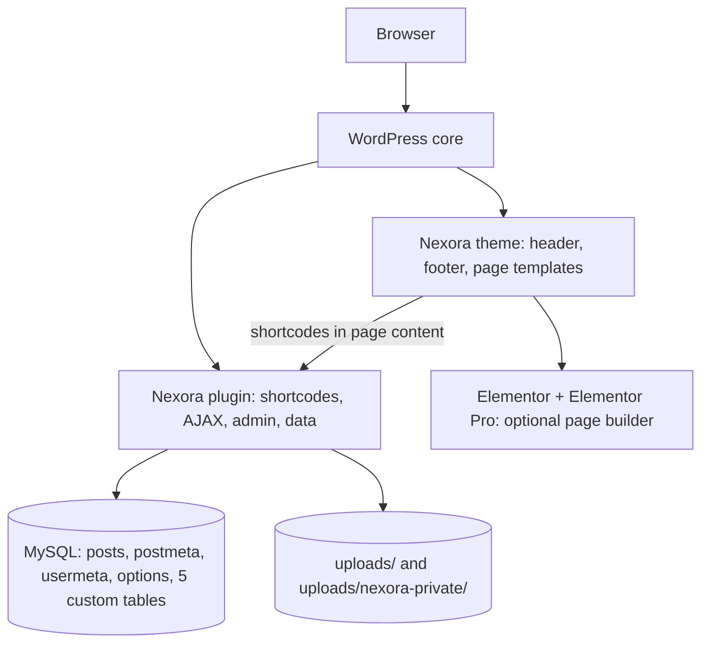
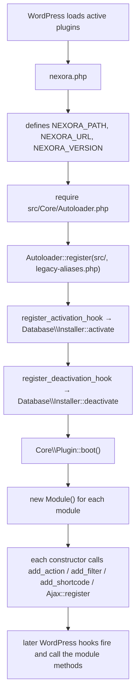
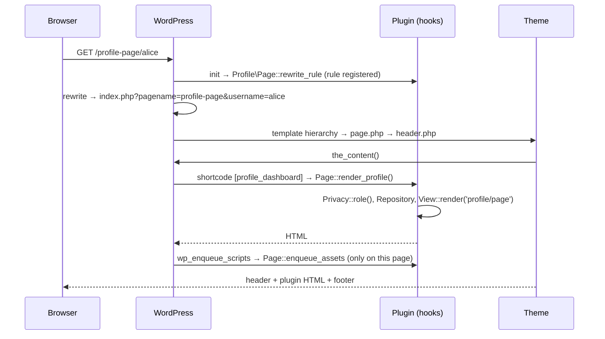
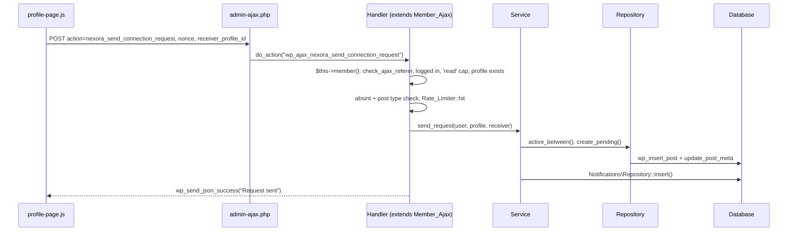
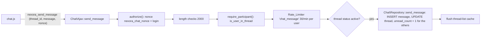
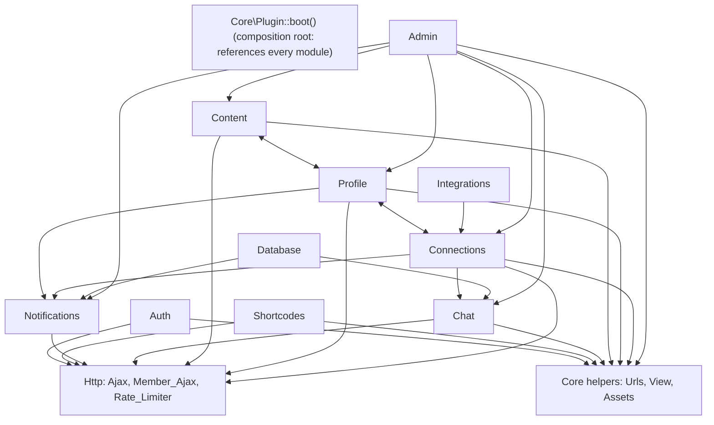

# Nexora architecture

How the plugin is put together, how a request moves through it, and why it is built this way. Everything here was checked against the code on branch `docs/developer-guide`. Start with the [developer guide](NEXORA-DEVELOPER-GUIDE.md) if you are new.

Contents: [1 Layers](#1-layers) · [2 Bootstrap](#2-bootstrap-from-wordpress-to-your-code) · [3 Composer, vendor, autoloading](#3-composer-vendor-and-autoloading) · [4 Folder map](#4-folder-map) · [5 Request flows](#5-request-flows) · [6 Dependencies between modules](#6-dependencies-between-modules) · [7 Decisions](#7-architectural-decisions) · [8 Old vs new](#8-before-and-after-the-refactor)

---

## 1. Layers



| Layer | Owns | Does not own |
|---|---|---|
| WordPress core | users, posts, meta, options, hooks, AJAX endpoint (`admin-ajax.php`), media library, rewrite engine | anything Nexora specific |
| **Nexora plugin** (`wp-content/plugins/nexora`) | registration, login, OTP, profiles, connections, chat, notifications, privacy rules, uploads policy, admin screens, database tables | page chrome (header/footer) |
| **Nexora theme** (`wp-content/themes/nexora-theme`) | header, footer, 404, archive/single/search layouts, settings page for branding, sample Elementor pages | any member data or business rule |
| Elementor / Elementor Pro / ACF | optional page building | third-party: never edit |

Because everything a member can *do* lives in the plugin, switching the theme keeps login, registration, profiles, connections, chat and notifications working. The shortcode pages (`[profile_login]` etc.) then render inside whatever theme is active; the plugin loads its own stylesheet and, when the active theme is not `nexora-theme`, the Plus Jakarta Sans font (`Core\Assets::enqueue_tokens`). See [THEME.md](THEME.md).

---

## 2. Bootstrap: from WordPress to your code



[nexora.php](../wp-content/plugins/nexora/nexora.php) is deliberately tiny. It holds the plugin header, three constants and the wiring above, and **no logic**.

[`Core\Plugin::boot()`](../wp-content/plugins/nexora/src/Core/Plugin.php) is the application coordinator. It is a static method that creates every module once. Modules do not create themselves and nothing is lazily constructed; each module's constructor is where that module attaches itself to WordPress (it registers its hooks). The order is kept as it has always been, because hook priority within the same hook follows registration order:

1. `Auth\Registration`, `Auth\Login`
2. `Admin\Settings`, `Admin\Menu` (with `Admin\Pages`), `PostTypes\Registrar`, `Admin\Meta_Boxes`, `Admin\List_Columns`
3. `Profile\Page`, `Profile\Ajax`, `Connections\Ajax`, `Notifications\Ajax`, `Content\Ajax`
4. `Profile\Private_Documents`, `Profile\Documents_Migration`, `Profile\Upload_Policy`
5. `Shortcodes\Home`, `Integrations\Better_Messages`, `Chat\Module`, `Auth\Recaptcha`, `Shortcodes\Stats`, `Shortcodes\Contact_Form`
6. `Database\Migrations`, `Connections\Cache`, `Core\I18n`, `Core\Assets`, `Core\Access_Control`

Constants (all in `nexora.php`):

| Constant | Value | Used for |
|---|---|---|
| `NEXORA_PATH` | plugin directory path | `View::render()` finds `templates/`, autoloader finds `src/` |
| `NEXORA_URL` | plugin URL | enqueueing CSS/JS |
| `NEXORA_VERSION` | `1.0.6` | cache-busting query string on **every** plugin asset |

Lifecycle events:

| Event | What runs |
|---|---|
| Activation | `Installer::activate()` → `Migrations::run()` → `dbDelta` creates/updates the 5 tables and stores `nexora_db_version` |
| Every request | `plugins_loaded` → `Migrations::maybe_upgrade()` compares the stored `nexora_db_version` with `Migrations::DB_VERSION` and upgrades if behind |
| Deactivation | `Installer::deactivate()` deletes the `rewrite_rules` option and the `nexora_home_stats` transient. **All data stays.** |
| Uninstall (delete in Plugins screen) | `uninstall.php` → `Database\Uninstaller::run()`; does nothing unless the setting `nexora_delete_data_on_uninstall` is on |

Uninstall defaults to keeping data because the site holds real members' profiles and ID documents; deleting a plugin by accident must not destroy them. Details: [DATABASE.md](DATABASE.md#8-lifecycle).

---

## 3. Composer, vendor and autoloading

**Short answer: production does not use Composer at all.** `vendor/` is a developer-machine folder.

* [composer.json](../wp-content/plugins/nexora/composer.json) says so in its own description. `require` lists only `php >= 8.0`. `require-dev` lists three packages: `wp-coding-standards/wpcs` (^3.1), `phpcompatibility/phpcompatibility-wp` (^2.1) and `dealerdirect/phpcodesniffer-composer-installer` (^1.0). They provide the `phpcs` and `phpcbf` commands.
* `composer.lock` pins the exact versions installed, so every developer and CI run gets the same rule set. `composer install` installs what the lock says; `composer update` re-resolves versions and rewrites the lock, so run it only on purpose.
* `vendor/` is git-ignored (blanket `vendor/` rule in the root `.gitignore`) and is never deployed. It contains `bin/phpcs`, `bin/phpcbf`, Composer's own `autoload.php` and the sniff libraries. Never edit it by hand; delete it and run `composer install` to rebuild.
* The `scripts` block defines `composer lint` (`phpcs`), `composer lint:fix` (`phpcbf`) and `composer test` (`../../../../tests/run.sh`).
* The `autoload` block maps `Nexora\` to `src/` (PSR-4). This is **not used at runtime**: `nexora.php` never requires `vendor/autoload.php`. The plugin ships its own loader so that it works on a server where nobody ever ran Composer.

### How the built-in autoloader maps a class to a file

[`Core\Autoloader`](../wp-content/plugins/nexora/src/Core/Autoloader.php) registers one `spl_autoload_register` callback. When PHP meets an unknown class:

```text
Nexora\Core\Plugin
   │ strip the "Nexora\" prefix        → Core\Plugin
   │ replace "\" with "/"               → Core/Plugin
   │ prepend src/ and append ".php"     → <plugin>/src/Core/Plugin.php
   ▼ require_once that file (if it exists)
```

That is PSR-4: **namespace = folder path, class name = file name**. This is why adding a module means adding one file and one `new` line in `Plugin::boot()`, with no `require` anywhere.

A second job of the autoloader: **legacy aliases**. [legacy-aliases.php](../wp-content/plugins/nexora/src/Core/legacy-aliases.php) maps the pre-refactor global class names (`NEXORA_CHAT_DB`, `NEXORA_Notification`, `Nexora_Home_Page`, ...) to the new classes. If anything still asks for the old name, the autoloader calls `class_alias()`. The test harness and any third-party code that used the old names keep working.

---

## 4. Folder map

```text
nexora/                          (repository root = a full WordPress install)
├── CLAUDE.md, README.md         project guidance (read first)
├── docs/                        this documentation
├── tests/                       WP-CLI test harness (run.sh, bootstrap.php, php/, golden/, child/)
├── .claude/skills/              project playbooks (add module, add endpoint, db table, ...)
└── wp-content/
    ├── plugins/nexora/          THE PLUGIN
    │   ├── nexora.php           header + constants + autoloader + boot
    │   ├── uninstall.php        gated data removal
    │   ├── composer.json/.lock  dev tooling only
    │   ├── phpcs.xml.dist       coding standard config
    │   ├── src/                 all PHP classes (PSR-4, namespace Nexora\)
    │   ├── templates/           all HTML (escaped in the template)
    │   ├── assets/              css/, js/, lib/sweetalert2
    │   └── languages/           nexora.pot
    └── themes/nexora-theme/     THE THEME
```

### `src/` modules

| Folder | Why it exists | Belongs here | Does **not** belong here |
|---|---|---|---|
| `Core/` | Plumbing every module needs | `Plugin`, `Autoloader`, `Assets`, `Access_Control`, `Urls`, `View`, `I18n`, `legacy-aliases.php` | feature logic |
| `Http/` | Shared request handling | `Ajax` (registrar + member guard), `Member_Ajax` (base class for handlers), `Rate_Limiter` | domain rules |
| `Auth/` | Getting in | `Registration`, `Login` (login, OTP send/verify, reset), `Otp`, `Recaptcha` | profile editing |
| `Profile/` | The member's own page and data | `Page` (shortcode, routing, assets), `Ajax` (edit forms), `Privacy`, `Fields`, `Repository`, `Private_Documents`, `Upload_Policy`, `Documents_Migration` | connections |
| `Connections/` | Member to member relationships | `Ajax`, `Service` (rules), `Repository` (queries), `Cache` | chat |
| `Notifications/` | Notice rows for a member | `Ajax`, `Repository` (table access) | deciding *when* to notify (the caller does) |
| `Content/` | Member posts (`user_content`) | `Ajax`, `Repository` | |
| `Chat/` | Private messaging | `Module` (assets + popup), `Ajax`, `Repository` (4 tables) | |
| `PostTypes/` | The 3 custom post types | `Registrar` | |
| `Admin/` | The "Nexora System" admin area | `Menu`, `Settings`, `Pages`, `Meta_Boxes`, `List_Columns` | front-end |
| `Shortcodes/` | Public shortcodes not tied to a module | `Home`, `Stats`, `Contact_Form` | |
| `Integrations/` | Third-party plugins | `Better_Messages` | |
| `Database/` | Schema lifecycle | `Installer`, `Migrations`, `Uninstaller` | queries for features (those are in each `Repository`) |

Per-class method tables are in [CODE-REFERENCE.md](CODE-REFERENCE.md).

---

## 5. Request flows

### 5.1 A normal page request



### 5.2 An AJAX request



Full table of endpoints: [AJAX-API.md](AJAX-API.md).

### 5.3 A profile request

1. The rewrite rule `^profile-page/([^/]+)/?$` → `index.php?pagename=profile-page&username=$matches[1]` (added in `Profile\Page::rewrite_rule`, query var `username` added in `Page::query_vars`).
2. `Page::render_profile()` (shortcode `[profile_dashboard]`):
   * not on the page `profile-page` → returns `''`;
   * guest → `profile/guest-wall` (log in prompt, no profile data);
   * administrator → `profile/admin-mode` (link to wp-admin);
   * no `username` → the member's own profile (`_profile_id` user meta);
   * `username` given → `Repository::id_by_username()`; unknown → `profile/not-found`;
   * `Privacy::role(current, owner)` → `guest | viewer | owner`, then `view_data()` builds the array; private fields (`email`, `phone`, ...) are filled **only when the role is `owner`**, then `profile/page` renders.
3. `Page::enqueue_assets()` (only on the profile page, `Assets::is_page_for`) localizes `profilePageData` including `Privacy::script_data()`, which again includes private fields only for the owner.

### 5.4 A chat request



User A cannot read user B's conversation because **every** thread endpoint calls `require_participant()`, which asks the `nexora_thread_participants` table whether `(thread_id, user_id)` exists for the *session's* user. The browser never says who it is: the user id comes from the logged-in session. See [the security section of the guide](NEXORA-DEVELOPER-GUIDE.md#security-architecture).

---

## 6. Dependencies between modules

Arrows mean "references a class in". Generated by scanning every `Nexora\Module\` reference in `src/` (comments excluded from the reading, `legacy-aliases.php` excluded).



What the scan shows:

* `Core` appears to depend on everything only because `Core\Plugin::boot()` is the composition root that creates all modules. Apart from that, `Core` helpers (`Urls`, `View`, `Assets`) are leaves that other modules call.
* **Two real two-way pairs exist**, both through static repository/helper calls rather than shared state: `Profile` ↔ `Connections` (the profile page counts mutual connections; the connection handlers use `Profile\Repository` for names and images) and `Profile` ↔ `Content` (the profile page renders the content feed; content saving checks `Profile\Private_Documents`).
* `Chat` does **not** reference `Connections` classes. It reads the `user_connections` post meta directly (`sender_user_id`, `receiver_user_id`, `status`) in `Chat\Ajax::user_in_connection()` and `create_thread_with_subject()`. The coupling is on the data shape, so changing those meta keys would break chat without any class reference showing it.
* `Connections\Service` calls `Notifications\Repository::insert()` and `Chat\Repository::inactive_threads_by_connection()` (removing a connection closes its chat threads).
* `Database\Migrations` calls `create_table()` on the notification and chat repositories, so the table definitions live next to the queries that use them.

---

## 7. Architectural decisions

| Decision | Why | Alternative not taken | Impact |
|---|---|---|---|
| **Built-in PSR-4 autoloader**, Composer only for dev tools | The host never runs Composer; a missing `vendor/` on production must not break the site | Commit `vendor/` or require Composer on the server | Zero runtime dependencies; `composer.json`'s `autoload` block is informational |
| **Namespaces + one class per file** (`Nexora\Module\Class`) | The old code was 10 global `NEXORA_*` classes of up to 1,300 lines | Keep global classes | Old names still resolve through `legacy-aliases.php` |
| **Thin bootstrap + `Plugin::boot()`** | Adding a module = one file + one line | A DI container | Simple and visible; modules still `new` their own helpers |
| **Repository / Service split** (`Connections`, `Content`, `Chat`, `Notifications`, `Profile`) | Queries in one place; rules testable without HTTP | Queries inside AJAX handlers | Handlers stay short: guard, sanitize, call service, reply |
| **HTML in `templates/` rendered by `View::render()`** | Escaping in one visible place; markup diffable; golden snapshots possible | HTML strings in PHP classes | `tests/golden/*.html` pin the exact markup of every screen |
| **Custom post types + meta for the data model** | Existing live data; admin UI for free | Custom tables for everything | Kept as-is (compat lock). Only notifications and chat use custom tables |
| **Versioned migrations** (`nexora_db_version`) | Schema changes apply on update without reactivation | Activation-only table creation | See [DATABASE.md](DATABASE.md#7-migrations) |
| **`nexora_`-prefixed AJAX actions with deprecated aliases** | Namespacing the actions while old cached JS keeps working | Rename and break | `Http\Ajax::register()` registers both; alias fires `nexora_deprecated_ajax_action` |
| **One AJAX guard** (`Http\Ajax::member()`) | Nonce + login + capability + profile in one audited place | Per-handler checks | `test-endpoint-matrix.php` proves every endpoint rejects bad callers |
| **Atomic rate limiter** (`Http\Rate_Limiter`) | Non-atomic transients race | Per-request transient counters | Fixed-window counters, per IP or per user |
| **Private ID documents** (`uploads/nexora-private/` + gated download) | Public media URLs exposed ID documents | Keep in Media Library | URLs go through `admin-ajax.php?action=nexora_document` |
| **Object-cache with version stamps** for connection and thread lists | Cut repeated meta queries without stale data | Transients per list | Needs a persistent object cache to help across requests |
| **Golden-output tests** | Prove the refactor changed no markup | Eyeballing | A deliberate markup change must regenerate the goldens |

---

## 8. Before and after the refactor

Verified from `git ls-tree main wp-content/plugins/nexora` (the original layout) and the current tree. The original problems found in the Phase 0 audit: 1,000+ line classes mixing concerns, a manual `require_once` list, HTML built inside AJAX handlers, no versioned schema, no i18n, scripts loaded on every page, ID documents in the public media folder.

| Old file | Old responsibility | New location |
|---|---|---|
| `nexora.php` (`NEXORA_System`) | constants, requires, assets, access control, DB install | `nexora.php` (thin), `Core\Plugin`, `Core\Assets`, `Core\Access_Control`, `Database\Installer` |
| `includes/class-cpt.php` (1,320 lines) | CPT registration, settings API, admin menu, meta boxes, list columns, admin chat/notification pages | `PostTypes\Registrar`, `Admin\Settings`, `Admin\Menu`, `Admin\Pages`, `Admin\Meta_Boxes`, `Admin\List_Columns` + `templates/admin/*` |
| `includes/class-profile-page.php` (1,035 lines) | rewrite, assets, role logic, ~700 lines of HTML, upload capability | `Profile\Page`, `Profile\Privacy`, `Profile\Fields`, `Profile\Upload_Policy`, `templates/profile/*` |
| `includes/class-profile-ajax.php` (945 lines) | 17 AJAX handlers | `Profile\Ajax`, `Connections\Ajax` + `Connections\Service`, `Notifications\Ajax`, `Content\Ajax` |
| `includes/class-profile-helper.php` | profile/connection lookups | `Profile\Repository`, `Connections\Repository` |
| `includes/class-login.php` | login, OTP, reset | `Auth\Login`, `Auth\Otp` |
| `includes/class-registration.php` | registration form and handler | `Auth\Registration` |
| `includes/class-google-recaptcha.php` | captcha | `Auth\Recaptcha` |
| `includes/class-notification.php` | notification table access | `Notifications\Repository` |
| `includes/class-home-page.php` | `[nexora_home]`, stats | `Shortcodes\Home` |
| `includes/class-shortcodes.php` | `[nexora_stat]`, `[nexora_auth_buttons]` | `Shortcodes\Stats` |
| `includes/class-contact-form.php` | contact form | `Shortcodes\Contact_Form` |
| `includes/class-better-message-chat.php` | Better Messages filter | `Integrations\Better_Messages` |
| `chat/class-chat-core.php` | chat assets + popup | `Chat\Module` |
| `chat/class-chat-ajax.php` | chat endpoints | `Chat\Ajax` |
| `chat/class-chat-db.php` | chat tables | `Chat\Repository` |
| `chat/templates/*` | chat markup | `templates/chat/*` |

New in the refactor (no old equivalent): `Http\*`, `Profile\Private_Documents`, `Profile\Documents_Migration`, `Database\Migrations`, `Database\Uninstaller`, `Connections\Cache`, `Core\I18n`, `Core\View`, `Core\Urls`, `Auth\Otp` references, `uninstall.php`, `templates/mail/*`.
