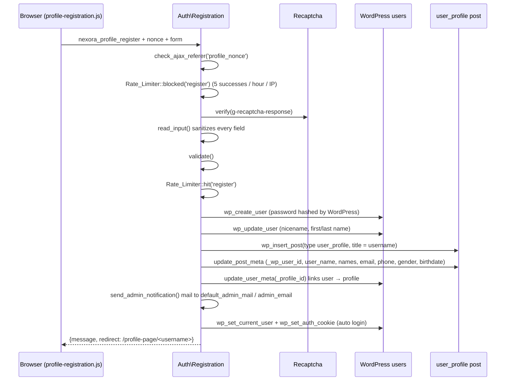

# Nexora authentication

Registration, login, logout, password reset with a one-time code (OTP), reCAPTCHA, rate limits and access control, as implemented in `src/Auth/`, `src/Http/` and `src/Core/Access_Control.php`. Back to the [developer guide](NEXORA-DEVELOPER-GUIDE.md).

**What does not exist (so do not look for it):** there is no OTP at registration or at login, and no email verification at signup. The OTP is used only for the **forgot-password** flow. Login is username/email + password (+ reCAPTCHA when enabled). Email verification at signup was identified in the Phase 0 audit and deliberately deferred.

Contents: [1 Pieces](#1-the-pieces) · [2 Registration](#2-registration) · [3 Login and logout](#3-login-and-logout) · [4 Password reset with OTP](#4-password-reset-with-otp) · [5 OTP internals](#5-otp-internals) · [6 reCAPTCHA](#6-recaptcha) · [7 Access control](#7-access-control) · [8 Enumeration and brute force](#8-enumeration-and-brute-force)

---

## 1. The pieces

| Class | Role |
|---|---|
| [Auth\Registration](../wp-content/plugins/nexora/src/Auth/Registration.php) | shortcode `[profile_registration]`, AJAX `nexora_profile_register`, creates the WP user and the profile post |
| [Auth\Login](../wp-content/plugins/nexora/src/Auth/Login.php) | shortcode `[profile_login]`, AJAX `nexora_profile_login`, `nexora_send_otp`, `nexora_verify_otp`, `nexora_reset_password` |
| [Auth\Otp](../wp-content/plugins/nexora/src/Auth/Otp.php) | OTP + reset-token + opaque-reference storage rules (no HTTP) |
| [Auth\Recaptcha](../wp-content/plugins/nexora/src/Auth/Recaptcha.php) | renders the widget and verifies the answer with Google |
| [Http\Rate_Limiter](../wp-content/plugins/nexora/src/Http/Rate_Limiter.php) | throttles each step |
| [Core\Access_Control](../wp-content/plugins/nexora/src/Core/Access_Control.php) | keeps members out of `wp-admin` and `wp-login.php` |
| [Core\Urls](../wp-content/plugins/nexora/src/Core/Urls.php) | the three page URLs and where a user lands after login |
| Templates | `templates/auth/{login-form,login-state,registration-form,registration-state}.php`, `templates/mail/*` |
| JS | `assets/js/profile-login.js`, `assets/js/profile-registration.js` |

The login page, registration page and profile page must exist with the slugs `login-page`, `registration-page`, `profile-page` (the theme's Appearance → Sample Content installer creates them with the shortcodes). Their JS and nonce are only loaded on those pages (`Core\Assets::is_page_for`).

---

## 2. Registration



Validation (`Registration::validate`), in order: required `email user_name password confirm_password`; valid email; username matches `^[A-Za-z0-9_.-]{3,30}$` (it becomes part of profile URLs); password at least 8 characters; passwords equal; gender in `male/female/other/''` (otherwise cleared); birthdate strictly `Y-m-d`, a real date, not in the future; username/email not already taken ("User already exists").

Passwords are **never sanitized** (that would change them); they go straight to `wp_create_user`, which hashes them. If creating the profile post fails, the just-created WordPress user is deleted (rollback).

Roles: `wp_create_user` gives the site's default role (subscriber unless changed in Settings). Members therefore have the `read` capability only; extra upload rights are granted per request by `Profile\Upload_Policy`.

---

## 3. Login and logout

`Auth\Login::handle_login` (`nexora_profile_login`):

1. nonce → limiter `login` (10 per 15 min per IP) → reCAPTCHA;
2. username or email field; an email is translated to the login with `get_user_by('email')`;
3. `wp_signon(['user_login','user_password','remember' => true], is_ssl())`;
4. on any failure the same message: **"Invalid username or password"** (unknown email, wrong password, empty field are indistinguishable);
5. success → `{redirect: Urls::profile_for($user)}`: administrators go to `/profile-page/` (admin-mode card), members to `/profile-page/<their login>`.

`Access_Control::login_redirect` applies the same landing rule to any other login that goes through WordPress.

**Logout** is WordPress's own: `wp_logout_url(Urls::login())` (the "already logged in" card `templates/auth/login-state.php` and the theme header use it). `Access_Control::block_wp_login` explicitly lets the `logout` and `postpass` actions through.

---

## 4. Password reset with OTP

```mermaid
stateDiagram-v2
    [*] --> Idle
    Idle --> OtpIssued: send_otp (username + email match)
    Idle --> Idle: send_otp (no match: SAME reply, nothing stored)
    OtpIssued --> OtpIssued: send_otp again (reuses the valid OTP, no new mail)
    OtpIssued --> TokenIssued: verify_otp correct
    OtpIssued --> OtpIssued: wrong code (attempts + 1)
    OtpIssued --> Idle: expired / 5 wrong attempts (Otp::clear)
    TokenIssued --> Done: reset_password (token valid, password ≥ 8)
    TokenIssued --> Idle: token older than 10 min
    Done --> [*]: OTP, token and reference deleted; user logged in; email sent
```

Step by step (`Login::send_otp`, `verify_otp`, `reset_password`):

| Step | Browser sends | Server does | Browser gets |
|---|---|---|---|
| 1 `nexora_send_otp` | `username`, `email` | nonce → limiter `otp_send` → looks the user up; if no user or the email differs (case-insensitive) answers exactly as for success. If a valid OTP already exists it does not mail another (prevents mail flooding). Otherwise `Otp::issue()` and `wp_mail` the 6-digit code | `{user_id: <opaque reference>, message: "If the details are correct, an OTP has been sent…"}` |
| 2 `nexora_verify_otp` | `user_id` (the reference), `otp` | nonce → limiter `otp_verify` → `Otp::resolve_ref()` → `Otp::verify()` | `{message, token}` or an error |
| 3 `nexora_reset_password` | `user_id` (reference), `token`, `password` | nonce → limiter `reset_password` → `Otp::token_valid()` → password ≥ 8 → `wp_set_password` → `Otp::clear()` + `forget_ref()` → confirmation mail → auto-login | `{redirect}` |

---

## 5. OTP internals

All of it is in [Auth\Otp](../wp-content/plugins/nexora/src/Auth/Otp.php).

| Item | Detail |
|---|---|
| Generation | `random_int(100000, 999999)`: a cryptographically secure 6-digit number |
| Storage | user meta `reset_otp` holds `wp_hash_password($otp)`, a hash, never the code. Plus `otp_expiry` (now + 10 min = `OTP_TTL`) and `otp_attempts` (0). Issuing also deletes any old `reset_token*` |
| Delivery | `wp_mail()` plain text to the account's email |
| Verification | missing hash → "No OTP found"; past expiry → "OTP expired" and cleared; attempts ≥ 5 (`MAX_ATTEMPTS`) → cleared and "Too many wrong attempts"; wrong code → `otp_attempts + 1`, "Invalid OTP"; correct → OTP meta deleted, **reset token** created |
| Reset token | `wp_generate_password(32, false)`; stored hashed in `reset_token` with `reset_token_expiry` (10 min = `TOKEN_TTL`). Proves the email owner passed step 2. Single use |
| Opaque reference | the "user id" the browser holds is **not** the real user id. `Otp::issue_ref()` makes 32 hex characters (`bin2hex(random_bytes(16))`), stores `transient nexora_otp_ref_<ref>` → user id for 25 minutes, and returns the ref. `resolve_ref()` accepts only `^[a-f0-9]{32}$`. For an unknown account `issue_ref(0)` returns a ref that maps to nothing, so responses look identical. Because refs are random, the OTP endpoints cannot be used to probe sequential user ids |
| Resend | calling `send_otp` again while the OTP is still valid returns the same shape without sending mail; after expiry a new one is issued |
| Cleanup | `Otp::clear()` deletes the five user-meta keys; `forget_ref()` deletes the transient; expired transients expire on their own |

Rate limits layered on top: 5 sends / 15 min, 20 verifications / 15 min (per client IP), plus the per-OTP 5 attempts.

---

## 6. reCAPTCHA

[Auth\Recaptcha](../wp-content/plugins/nexora/src/Auth/Recaptcha.php) reads the options `recaptcha_site_key`, `recaptcha_secret_key`, `recaptcha_enabled`.

* `is_enabled()` is true only if the flag **and** both keys are set.
* If it is not enabled, `verify()` returns success (the captcha is simply off).
* **Local skip policy** (`is_local()`): the captcha is skipped when the `nexora_skip_captcha` filter returns true, **or** when `wp_get_environment_type()` is `local` **and** the site's own hostname (taken from the stored home URL, never from the request's `Host` header) resolves to a private/reserved address. A production server that merely sets `WP_ENVIRONMENT_TYPE=local` is therefore not exempt unless it also resolves to a private IP. Filters `nexora_captcha_site_host` and `nexora_captcha_host_ip` exist for tests.
* When enabled and not local: empty answer → "Captcha is required"; `wp_remote_post` to Google's `siteverify` (10 s timeout); a transport error → "Captcha request failed"; Google says no → "Captcha verification failed".

Captcha is applied in `handle_login` and `registration_form_handle`. It is **not** applied to the OTP endpoints (those rely on the rate limiter) or the contact form (honeypot + limiter).

---

## 7. Access control

[Core\Access_Control](../wp-content/plugins/nexora/src/Core/Access_Control.php) hooks:

| Hook | Method | Behaviour |
|---|---|---|
| `after_setup_theme` | `hide_admin_bar` | admin bar hidden for everyone without `manage_options` |
| `admin_init` | `block_wp_admin` | visitors → login page; members → their profile. **Exempt:** AJAX, REST, cron, `admin-post.php`, `admin-ajax.php` |
| `init` | `block_wp_login` | on `wp-login.php`: visitors → login page; members → their profile; administrators allowed; `logout` and `postpass` actions allowed |
| `login_redirect` | `login_redirect` | `Urls::profile_for($user)` |

Why it matters: members cannot reach the WordPress dashboard, and the default WordPress login form is not a second way in for non-admins. The exemption of `admin-ajax.php` is what lets the front end call AJAX at all; that is why every AJAX handler does its own nonce/login/ownership checks.

---

## 8. Enumeration and brute force

| Risk | Defence | Where |
|---|---|---|
| Learn which accounts exist via login | same message for unknown user / wrong password / unknown email | `Login::handle_login` |
| Learn which accounts exist via forgot-password | identical response and shape; opaque random references; no new mail while an OTP is live | `Login::send_otp`, `Otp::issue_ref` |
| Guess the OTP | 6-digit code hashed at rest, 10-minute life, 5 attempts per OTP, 20 verifications / 15 min / IP | `Otp::verify`, `Rate_Limiter` |
| Guess passwords | login limiter 10 / 15 min / IP, reCAPTCHA; password-change limiter per user | `Login`, `Profile\Ajax::update_profile_password` |
| Mass sign-ups | 5 successful registrations / hour / IP, reCAPTCHA | `Registration` |
| Mail flooding | OTP reuse; contact form limiter 3 / 10 min | `Login`, `Contact_Form` |
| Known remaining enumeration | registration answers "User already exists" for a taken username or email. This is inherent to sign-up forms; the mitigation is the sign-up limiter and captcha | `Registration::validate` |
| Behind a proxy/CDN every visitor shares one IP | set `NEXORA_CLIENT_IP_HEADER` (or the `nexora_client_ip_header` filter) to the trusted header so limits are per visitor | `Rate_Limiter::client_ip` |
