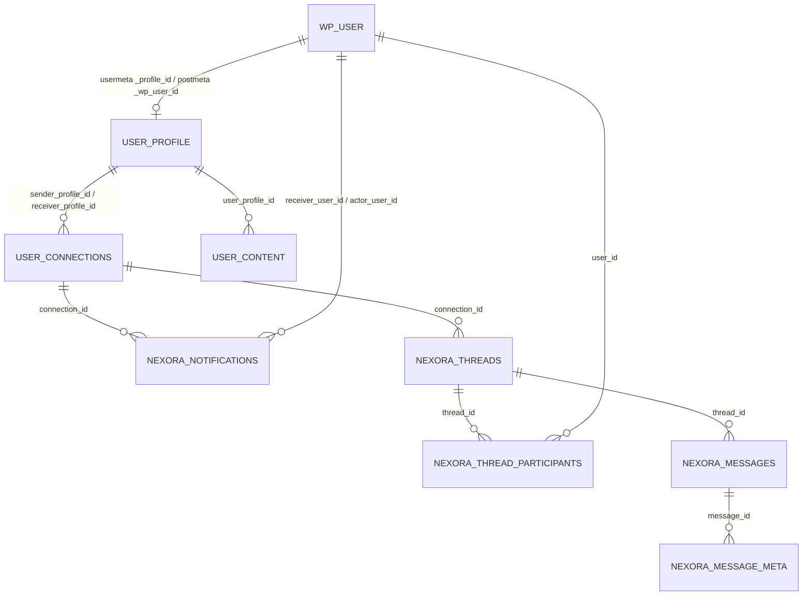
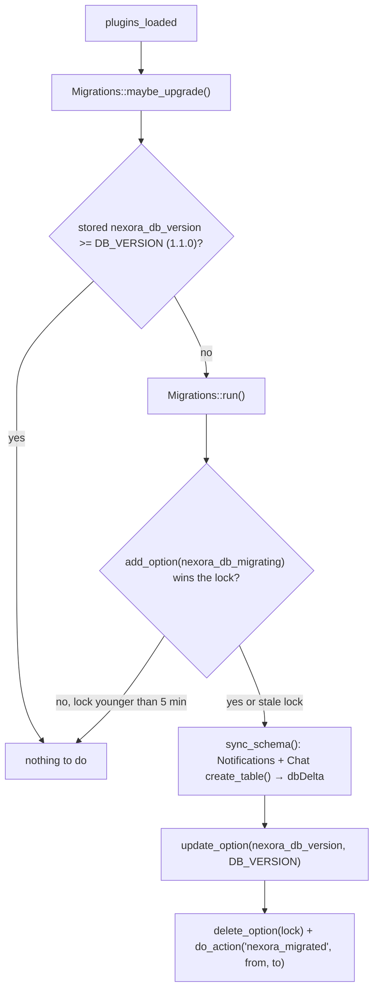

# Nexora data: tables, post types, meta, options, caches, migrations

Everything Nexora stores, where it is written and who reads it. Verified against `src/` on branch `docs/developer-guide`. Back to the [developer guide](NEXORA-DEVELOPER-GUIDE.md).

**Compatibility lock:** table names, column names, post type names, every meta key and every option name below exist on the live site. Do not rename them. See [safe changes](NEXORA-DEVELOPER-GUIDE.md#modifying-existing-functionality-safely).

Contents: [1 Overview](#1-overview) · [2 Custom tables](#2-custom-tables) · [3 Custom post types](#3-custom-post-types) · [4 Post meta](#4-post-meta) · [5 User meta](#5-user-meta) · [6 Options, transients, caches](#6-options-transients-and-caches) · [7 Migrations](#7-migrations) · [8 Lifecycle](#8-lifecycle) · [9 Caching](#9-caching)

---

## 1. Overview

| Data | Stored in | Why |
|---|---|---|
| Members' profiles, connections, posts | **custom post types** + post meta (`user_profile`, `user_connections`, `user_content`) | kept from the original design: free admin UI, existing live data |
| Notifications, chat | **5 custom tables** (`{prefix}nexora_*`) | high volume, simple row access, indexes |
| Credentials, OTP state, profile link | WordPress users + **user meta** | uses core password hashing |
| Settings | **options** | Settings API |
| Short-lived state | transients, options, object cache | OTP references, rate limits, caches |
| ID documents | files in `uploads/nexora-private/` + attachment posts | see [uploads](NEXORA-DEVELOPER-GUIDE.md#file-uploads-and-private-documents) |

The two-way link between a user and their profile is the backbone of ownership checks: user meta `_profile_id` (user → profile post) and post meta `_wp_user_id` (profile post → user). Registration writes both (`Auth\Registration::create_member`).

---

## 2. Custom tables

Prefix is `$wpdb->prefix` (usually `wp_`). SQL lives in each repository's `create_table()`; `Database\Migrations::sync_schema()` runs them through `dbDelta`.

| Table | Purpose | Defined / used by |
|---|---|---|
| `nexora_notifications` | one row per notification shown to a member | `Notifications\Repository` |
| `nexora_threads` | one chat conversation | `Chat\Repository` |
| `nexora_thread_participants` | who is in a thread plus their read state | `Chat\Repository` |
| `nexora_messages` | chat messages | `Chat\Repository` |
| `nexora_message_meta` | key/value extras per message (created, not currently written by any code path) | `Chat\Repository` (table only) |

### `nexora_notifications`

| Column | Type | Meaning |
|---|---|---|
| `id` | bigint unsigned, PK, auto | |
| `actor_user_id` | bigint unsigned | user who caused it |
| `actor_user_name` | varchar(100) | their login at that moment |
| `receiver_user_id` | bigint unsigned | who is told |
| `receiver_user_name` | varchar(100) | |
| `type` | varchar(50) | `request`, `accepted`, `rejected`, `removed` (the values `Connections\Service` writes) |
| `connection_id` | bigint unsigned, null | the `user_connections` post |
| `message` | text | English sentence stored at write time (not translated later) |
| `is_read` | tinyint(1) default 0 | 0 unread, 1 read |
| `created_at` | datetime default now | |

Indexes: `idx_receiver (receiver_user_id)`, `idx_actor (actor_user_id)`, `idx_receiver_read (receiver_user_id, is_read)`, `idx_created (created_at)`, `idx_type (type)`.

### `nexora_threads`

| Column | Type | Meaning |
|---|---|---|
| `id` | bigint unsigned PK | |
| `connection_id` | bigint unsigned null | connection this conversation belongs to |
| `status` | varchar(20) default `active` | `active` or `inactive` (closed when the connection is removed) |
| `type` | varchar(20) default `private` | |
| `subject` | varchar(255) null | chosen by the member |
| `last_message_id` | bigint unsigned null | for the list preview |
| `created_at`, `updated_at` | datetime | `updated_at` also changes on every new message |

Indexes: `idx_connection_id`, `idx_status`, `idx_updated_at`.

### `nexora_thread_participants`

| Column | Type | Meaning |
|---|---|---|
| `id` | PK | |
| `thread_id`, `user_id` | bigint unsigned | unique together (`unique_thread_user`) |
| `last_read` | datetime null | set by `mark_as_read_chat` |
| `unread_count` | int default 0 | +1 for the other participant on every message, reset to 0 on read |
| `is_muted`, `is_pinned` | tinyint(1) | columns exist; no UI code sets them |
| `created_at` | datetime | |

Indexes: `unique_thread_user (thread_id, user_id)`, `idx_user_id`, `idx_thread_id`. **This table is the authorization source for chat**: `Chat\Repository::is_user_in_thread()` checks a row exists.

### `nexora_messages`

`id` PK · `thread_id` · `sender_id` · `message` text not null · `created_at`. Indexes: `idx_thread_id`, `idx_thread_id_id (thread_id, id)` (added in migration 1.1.0 for the "latest N messages" query), `idx_created_at`.

### `nexora_message_meta`

`id` PK · `message_id` · `meta_key` varchar(255) · `meta_value` longtext. Index `idx_message_id`.

---

## 3. Custom post types

All three are registered in [PostTypes\Registrar](../wp-content/plugins/nexora/src/PostTypes/Registrar.php) on `init`. Common settings: `public => false` (no front-end URLs, not queryable from the front end), `show_ui => true`, `show_in_menu => 'nexora-system'` (under the "Nexora System" admin menu). Not exposed in REST (`show_in_rest` is not set, default false). No taxonomies. Default post capabilities (so administrators manage them; members never touch `wp-admin`, see `Core\Access_Control`).

| CPT | Supports | One post is | Created by | Front-end use |
|---|---|---|---|---|
| `user_profile` | title, thumbnail | one member's profile (title = username) | `Auth\Registration` | `Profile\Page`, connection and chat lists, stats |
| `user_connections` | title | one request/relationship between two profiles (title `a->b`) | `Connections\Repository::create_pending` | connection tabs, chat authorization, stats |
| `user_content` | title, editor, thumbnail | one member post (title, text, featured image) | `Content\Repository::create` | profile feed and history |

Admin: the edit screens show meta boxes (`Admin\Meta_Boxes`, templates `templates/admin/metabox-*.php`) and extra list columns (`Admin\List_Columns`).

---

## 4. Post meta

### `user_profile` posts

| Meta key | Holds | Private? (only the owner receives it) | Written by | Read by |
|---|---|---|---|---|
| `_wp_user_id` | WP user id of the owner | n/a (internal) | Registration | ownership checks everywhere |
| `user_name` | login name | public | Registration | URLs, lists |
| `first_name`, `last_name` | names | public | Registration, `Profile\Ajax::update_personal_info`, admin | profile, lists |
| `bio` | short text | public | `update_personal_info` | profile |
| `email` | email | **private** | Registration, admin | owner only |
| `phone` | phone | **private** | Registration, `update_personal_info` | owner only |
| `gender` (`male`/`female`/`other`/``) | | **private** | Registration, `update_personal_info` | owner only |
| `birthdate` (`Y-m-d`) | | **private** | same | owner only |
| `linkedin_id` | | **private** | `update_personal_info` | owner only |
| `perm_address`, `perm_city`, `perm_state`, `perm_pincode`, `corr_address`, `corr_city`, `corr_state`, `corr_pincode` | permanent / correspondence address | **private** | `update_address_info` | owner only |
| `company_name`, `designation`, `company_email`, `company_phone`, `company_address` | work details | **private** (`Fields::WORK` is in `owner_only()`) | `update_work_info` | owner only |
| `profile_image`, `cover_image` | attachment id | public | `update_documents_info` | any viewer |
| `aadhaar_card`, `driving_license`, `company_id_card` | attachment id of an ID document | **private** + file is also gated | `update_documents_info` | owner/admin via `nexora_document` |

The key lists are the constants in [Profile\Fields](../wp-content/plugins/nexora/src/Profile/Fields.php) (`PERSONAL`, `ADDRESS`, `WORK`, `DOCUMENTS`, plus `owner_only()` and `admin_editable()`). Add a profile field there and the AJAX handlers, profile page and admin meta box pick it up.

### `user_connections` posts

| Key | Holds |
|---|---|
| `sender_user_id`, `sender_profile_id`, `sender_user_name` | who sent the request |
| `receiver_user_id`, `receiver_profile_id`, `receiver_user_name` | who received it |
| `status` | `pending`, `accepted`, `rejected`, `removed` |

### `user_content` posts

`user_id` (author user), `user_profile_id`, `user_name`; image is the WordPress featured image (`_thumbnail_id`).

### Attachment posts

`_nexora_private` = `'1'` on files moved to the private folder (`Profile\Private_Documents::FLAG`).

---

## 5. User meta

| Meta key | Holds | Private? | Written by | Read by |
|---|---|---|---|---|
| `_profile_id` | id of the member's `user_profile` post | internal | Registration | `Http\Ajax::member`, everywhere |
| `reset_otp` | **hash** of the 6-digit code (`wp_hash_password`) | secret | `Auth\Otp::issue` | `Otp::verify` |
| `otp_expiry` | unix time | | `Otp::issue` | `Otp::verify`, `has_active_otp` |
| `otp_attempts` | wrong-guess counter | | `Otp::issue` (0), `Otp::verify` | `Otp::verify` |
| `reset_token` | **hash** of the reset token | secret | `Otp::verify` | `Otp::token_valid` |
| `reset_token_expiry` | unix time | | `Otp::verify` | `Otp::token_valid` |

All OTP/token keys are deleted by `Otp::clear()` (after reset, expiry or too many attempts). WordPress itself stores the password hash in `wp_users.user_pass`.

---

## 6. Options, transients and caches

### Options (all registered with the Settings API in `Admin\Settings`, group `profile_settings_group`)

| Option | Holds | Autoload default |
|---|---|---|
| `default_profile_image`, `default_cover_image`, `default_document_image`, `default_home_cover_image`, `default_feed_experience_image`, `default_real_time_chat_image`, `default_smart_connections_image` | attachment ids of fallback images | yes |
| `default_admin_mail` | address that receives "new member" emails (falls back to `admin_email`) | yes |
| `nexora_home_eyebrow`, `nexora_home_title`, `nexora_home_subtitle`, `nexora_home_features`, `nexora_home_testimonials` | texts for `[nexora_home]` (empty = built-in defaults) | yes |
| `recaptcha_site_key`, `recaptcha_secret_key`, `recaptcha_enabled` | Google reCAPTCHA settings. The secret is never printed back; the form shows a mask | yes |
| `nexora_delete_data_on_uninstall` | `1` = uninstall deletes all data (default off) | yes |
| `nexora_db_version` | schema version, compared with `Migrations::DB_VERSION` | yes |
| `nexora_db_migrating` | lock written during a migration | no |
| `nexora_upload_cap_cleaned` | one-time flag: the old stored `upload_files` role capability was removed | no |
| `nexora_rl_<md5>_<window>` | **rate-limit counters** when no persistent object cache exists (otherwise the object cache group `nexora_rl` is used) | no |

### Transients

| Transient | TTL | Holds | Set by |
|---|---|---|---|
| `nexora_home_stats` | 1 hour | `[members, connections, posts, chats]` counts | `Shortcodes\Home::get_stats`; deleted by `flush_stats()` on user/post changes |
| `nexora_otp_ref_<32 hex>` | 25 min | user id behind the opaque reference the browser holds | `Auth\Otp::issue_ref` |

### Object cache groups

| Group | Keys | Invalidation |
|---|---|---|
| `nexora_connections` | `ids_<profile>_<ver>`, `pairs_<profile>_<ver>`, `blocked_<profile>_<ver>`, `version` | `Connections\Cache` bumps `version` on connection meta changes, status transitions, deletes |
| `nexora_chat` | `threads_<user>_<ver>`, `version` | `Chat\Repository` bumps `version` on every write |
| `nexora_rl` | rate-limit counters | expire with their window |

---

## 7. Migrations

[Database\Migrations](../wp-content/plugins/nexora/src/Database/Migrations.php) keeps the tables in step with the code.

* **Idempotent**: `dbDelta` only creates missing tables/columns/indexes and never drops. Running it again returns an empty change list (`test-lifecycle.php` asserts this).
* The table SQL is written in the format `dbDelta` needs (two spaces after `PRIMARY KEY`, `KEY` not `INDEX`, one column per line, no comments). Do not "tidy" it.
* A fresh install and an activation go through the same path (`Installer::activate()` → `Migrations::run()`).
* Version 1.1.0 added the indexes `messages(thread_id,id)`, `threads(status)`, `threads(updated_at)`.
* **Failure behaviour (inferred from implementation):** a PHP fatal inside `sync_schema()` leaves the version unchanged and the lock in place; the next attempt is blocked for up to 5 minutes, then retried. `dbDelta` SQL errors do not throw: `run()` still stores the new version, so a silently failed `dbDelta` would not be retried. After a deploy, confirm the tables and indexes (`SHOW INDEX FROM wp_nexora_messages`).
* Adding a migration: see [DEVELOPMENT-WORKFLOW.md](DEVELOPMENT-WORKFLOW.md#7-add-a-database-change).

---

## 8. Lifecycle

| Event | Code | Effect on data |
|---|---|---|
| Activate | `Installer::activate` | tables created/updated, `nexora_db_version` set |
| Deactivate | `Installer::deactivate` | deletes option `rewrite_rules` (so `/profile-page/<user>` stops being routed) and transient `nexora_home_stats`. **No data deleted** |
| Uninstall | `uninstall.php` → `Uninstaller::run()` | only if option `nexora_delete_data_on_uninstall` is on: deletes all posts of the 3 CPTs, the plugin's user meta, transients with the configured prefixes, drops the 5 tables, deletes `uploads/nexora-private/`, deletes the plugin's options (last, because it holds the switch) |

Never deleted by uninstall: WordPress user accounts, Media Library files outside `nexora-private/`.

**Known gaps found while documenting (not changed, documentation task):**

1. `Uninstaller::defaults()['transient_prefixes']` lists `nx_rl_`, `nx_reg_`, `nx_contact_`, names from an earlier design. Current rate-limit counters are options named `nexora_rl_*`, which the uninstaller's option list and transient deletion do not match. They are tiny, `autoload=no`, and expire by window, but they would survive an uninstall.
2. The comment above `nx_test_reset_limits()` in `tests/bootstrap.php` still mentions the old `nx_rl_*` names.
3. `nexora_message_meta` exists but no code writes to it.

---

## 9. Caching

| What | Where | TTL | Invalidated by | Why it matters |
|---|---|---|---|---|
| Home stats | transient `nexora_home_stats` | 1 h | `user_register`, `deleted_user`, `save_post_user_*` | avoid counting on every home page view |
| Accepted connections, pairs, blocked ids | object cache `nexora_connections` | 1 h | `added/updated/deleted_post_meta` for `status`/`sender_profile_id`/`receiver_profile_id` on `user_connections`; `transition_post_status`; `deleted_post` | Better Messages search and the profile page ask for these often |
| Member thread list | object cache `nexora_chat` | 1 h | any `Chat\Repository` write (create thread, send, mark read, rename, deactivate) | the chat sidebar reloads it |

Why invalidation matters: stale lists would show a removed connection as active (a privacy problem for chat search) or a wrong unread count. Both caches use a **version stamp** in the key; changing the stamp makes every old entry unreachable immediately without deleting them one by one.

Without a persistent object cache (Redis/Memcached), the object cache lasts only for one request, so these caches then help within a request but not across requests. The stats transient does persist (it lives in the options table).
