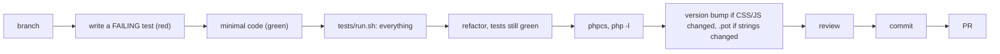
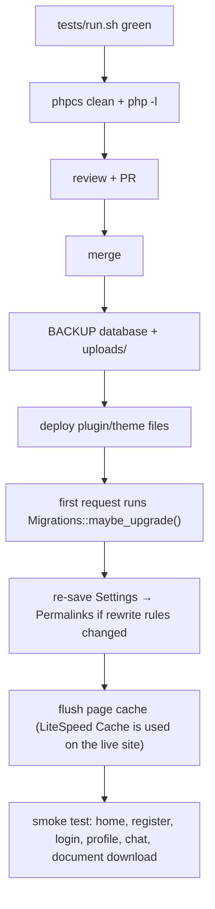

# Developing Nexora: workflow, tests, standards, how-tos, deployment

Commands in this file were run against this repository while writing it. Back to the [developer guide](NEXORA-DEVELOPER-GUIDE.md).

Contents: [1 Daily loop](#1-the-daily-loop) · [2 Tests](#2-tests) · [3 PHPCS](#3-phpcs) · [4 Other checks](#4-other-checks) · [5 Add a module](#5-add-a-module) · [6 Add an AJAX endpoint](#6-add-an-ajax-endpoint) · [7 Add a database change](#7-add-a-database-change) · [8 Add a setting, string or asset](#8-more-recipes) · [9 Deployment](#9-deployment)

---

## 1. The daily loop



Conventions observed in the git history and `.claude/skills/`:

* Branches are one per piece of work (`test/foundation`, `security/phase-1`, `refactor/phase-2`, `quality/phase-3`, `db/phase-4`, `tests/phase-5`); each is stacked on the previous.
* Commit subjects are conventional: `feat(db): …`, `refactor: …`, `security: …`, `style: …`, `docs: …`, `test: …`, `i18n: …`. Commits are authored as `Sahil Singla <98223428+singla25@users.noreply.github.com>`.
* PRs go through the `raise-pr` skill (it asks before committing, pushing, and merging). Merges are squash, gated on green checks. *No CI configuration exists in this repository (needs clarification: whether GitHub Actions run elsewhere).*
* Never commit `wp-config.php`, uploads, SQL dumps or secrets (`.gitignore` covers them), and never edit WordPress core or third-party plugins.
* Work test-first (`tdd-workflow` skill). A bug fix starts with a test that reproduces the bug.

---

## 2. Tests

There is no PHPUnit. Tests are plain PHP files executed **inside WordPress** by WP-CLI against the local dev database. Fixtures are throw-away users named `nxtest_*` and are removed afterwards.

### `tests/run.sh`

```bash
tests/run.sh                          # every tests/php/test-*.php
tests/run.sh tests/php/test-foo.php   # one file
```

What it runs (the whole script is 12 lines):

1. `cd` to the repository root.
2. `wp eval-file tests/purge.php --path=.` removes leftovers from a crashed earlier run (users `nxtest_*`, profile posts titled `nxtest_*`, and their threads/notifications). It touches fixture data only.
3. For each test file: prints `== <file>` and runs `wp eval-file <file> --path=.`.
4. Exits non-zero if any file failed (each test ends with `nx_test_finish()`, which prints `N passed, M failed` and halts with code 1 on failure).

Requires WP-CLI (`wp`) and the site's `wp-config.php`. Run it before every commit.

### Layout

| Path | Purpose |
|---|---|
| `tests/bootstrap.php` | loaded by every test: assertions (`nx_assert`, `nx_assert_same`, `nx_rejected`), fixtures (`nx_test_user`, `nx_test_connection`, `nx_test_thread`, `nx_test_attachment`), `nx_call_ajax()` (runs a `wp_ajax_*` handler in-process; `$guest = true` for `nopriv`), nonce helpers (`nx_profile_nonce`, `nx_chat_nonce`), `nx_assert_guard_matrix`, mail capture (`nx_test_capture_mail`), limit reset, golden helpers (`nx_assert_golden`) |
| `tests/purge.php` | cleanup of crashed runs |
| `tests/php/test-*.php` | the suites (below) |
| `tests/golden/*.html` | exact markup snapshots of every screen (41 files). Regenerate on purpose with `NX_UPDATE_GOLDEN=1 tests/run.sh tests/php/test-golden-output.php`, then review the diff |
| `tests/child/*.php` | scripts for code that ends in `exit` (redirects, `admin_post_*`, file serving); run as a child `wp eval-file` process by the tests |

### Suites (20)

| File | Proves |
|---|---|
| `test-smoke.php` | harness loads WordPress and the plugin, fixtures link user ↔ profile |
| `test-compat-contract.php` | the **compatibility contract**: shortcode, action, CPT, table, option and rewrite names still exist |
| `test-ajax-aliases.php` | every deprecated un-prefixed action still works and fires `nexora_deprecated_ajax_action` |
| `test-ajax-guard.php` | `Http\Ajax::member()` rules |
| `test-endpoint-matrix.php` | every AJAX action is in a manifest; none reachable without nonce/login; hostile payloads cause no warning |
| `test-profile-ajax.php`, `test-chat-ajax.php`, `test-auth-ajax.php` | per-endpoint behaviour, ownership, state machine |
| `test-shortcodes-privacy.php` | private fields never reach non-owners; contact form |
| `test-private-documents.php` | ID documents are private, gated, migratable |
| `test-upload-limits.php` | type/size/count limits |
| `test-rate-limits.php`, `test-captcha-policy.php` | limiter and captcha rules |
| `test-access-control.php` | wp-admin / wp-login redirects |
| `test-asset-loading.php` | scripts load only on the pages that need them |
| `test-better-messages.php` | the Better Messages search filter |
| `test-lifecycle.php` | migrations, indexes, deactivation, gated uninstall, caches |
| `test-golden-output.php` | exact markup of each screen |
| `test-i18n.php` | strings translatable, `.pot` current, a French `.mo` loads |
| `test-static-namespaces.php` | no unresolved class reference in `src/` |

Current result: 20 suites, 1146 assertions, 0 failures.

### Red → green → refactor, as applied in this project

1. Phase 0.5 wrote **characterization tests** that pass on the old code, pinning what members see.
2. Every security/structure change began with a test that failed for the right reason (for example `test-private-documents.php` failed while documents were still public), then the minimum code, then the full run.
3. Refactors kept golden snapshots byte-identical, so a move of code could not change output.

---

## 3. PHPCS

Coding standard: **WordPress Coding Standards (WPCS 3.1)** plus PHPCompatibilityWP for PHP 8.0+, configured in [phpcs.xml.dist](../wp-content/plugins/nexora/phpcs.xml.dist). It scans `nexora.php`, `src/` and `templates/`, ignores `vendor/` and `assets/lib/`.

```bash
cd wp-content/plugins/nexora
composer install            # once; installs phpcs/phpcbf into vendor/ (dev only)
vendor/bin/phpcs            # must print nothing
vendor/bin/phpcbf           # auto-fixes formatting
```

What it checks: Yoda conditions, spacing/indentation (tabs), escaping of output, nonce verification, prepared SQL, i18n (text domain must be `nexora`), prefixing of globals (`nexora_` / `Nexora`), docblocks on classes, properties and methods, and PHP-version compatibility. A reported violation is a rule from the WordPress standard; fix the code, or (rarely) add a documented `// phpcs:ignore <sniff> -- reason` on that line. The deliberate project-wide exclusions are listed with reasons inside `phpcs.xml.dist` (PSR-4 file names, per-file headers, `meta_query` use, the template-local variables, nonce verified centrally).

---

## 4. Other checks

```bash
# syntax of every PHP file in the plugin and theme
find wp-content/plugins/nexora wp-content/themes/nexora-theme -name '*.php' -not -path '*/vendor/*' -print0 | xargs -0 -n1 php -l | grep -v '^No syntax errors'

# regenerate the translation template after adding strings
wp i18n make-pot wp-content/plugins/nexora wp-content/plugins/nexora/languages/nexora.pot --slug=nexora --domain=nexora --exclude=vendor,assets/lib
```

Also: bump `NEXORA_VERSION` in `nexora.php` (and the `Version:` header, which `test-i18n.php` asserts equals the constant) whenever plugin CSS/JS changes, because every plugin asset is enqueued with that version as its cache-busting query string. For theme assets bump `NXT_VERSION` in `functions.php`. UI behaviour is checked in a browser under `/nexora/` (skill `verify-like-a-user`); the tests cover logic and markup, not layout or JS interaction.

---

## 5. Add a module

Skill: `.claude/skills/nexora-add-module`. Example: a `Bookmarks` feature.

1. **Test first** in `tests/php/test-bookmarks.php`.
2. Create `src/Bookmarks/Service.php`, `src/Bookmarks/Repository.php`, `src/Bookmarks/Ajax.php`. Namespace `Nexora\Bookmarks`; file name = class name; first lines `if ( ! defined( 'ABSPATH' ) ) { exit; }`. No `require` needed: the autoloader maps `Nexora\Bookmarks\Service` → `src/Bookmarks/Service.php`.
3. Register: add `new \Nexora\Bookmarks\Ajax();` to `Core\Plugin::boot()`. Forgetting this line means the module silently does nothing.
4. Hooks go in the constructor (`add_action`, `add_shortcode`, `Http\Ajax::register`).
5. Markup in `templates/bookmarks/*.php` via `View::render()`; escape every printed value there.
6. Assets: enqueue only where needed with `Assets::is_page_for()`, depend on `nexora-tokens`, version with `NEXORA_VERSION`.
7. Run tests, PHPCS, regenerate the `.pot`, update `README.md`/docs.

## 6. Add an AJAX endpoint

Skill: `.claude/skills/nexora-add-ajax-endpoint`. In a handler class that `extends Member_Ajax`:

```php
// constructor
\Nexora\Http\Ajax::register( 'bookmark_profile', array( $this, 'bookmark_profile' ) );   // → nexora_bookmark_profile

public function bookmark_profile() {
    $auth = $this->member();                              // nonce + login + capability + profile
    $target = absint( $_POST['profile_id'] ?? 0 );        // sanitize
    if ( ! $target || get_post_type( $target ) !== 'user_profile' ) {   // validate; never trust an id
        wp_send_json_error( __( 'Profile not found', 'nexora' ) );
    }
    if ( \Nexora\Http\Rate_Limiter::hit( 'bookmark', 'u' . $auth['user_id'] ) ) {   // abusable? add the bucket to Rate_Limiter::defaults()
        wp_send_json_error( \Nexora\Http\Rate_Limiter::message() );
    }
    $result = $this->service->bookmark( $auth['profile_id'], $target );   // rules in a Service, queries in a Repository
    $result['ok'] ? wp_send_json_success( __( 'Saved', 'nexora' ) ) : wp_send_json_error( $result['message'] );
}
```

Checklist: guard first; ownership of anything referenced by id (`owns_attachment()`, `require_participant()`, compare against the session user); `$wpdb->prepare()` for SQL; reply only with `wp_send_json_*`; JS calls `nexora_bookmark_profile` with `profilePageData.ajaxUrl` and `.nonce`; add the action name to the manifest in `tests/php/test-endpoint-matrix.php` (the suite fails otherwise) plus specific tests (wrong owner, valid call); bump `NEXORA_VERSION` for the JS. See [AJAX-API.md](AJAX-API.md).

## 7. Add a database change

Skill: `.claude/skills/nexora-db-table`.

1. Edit the `dbDelta` SQL in the owning repository's `create_table()` (new table: add a `create_table()` and call it from `Migrations::sync_schema()`). Follow dbDelta rules: two spaces after `PRIMARY KEY`, `KEY` not `INDEX`, one column per line, no comments, lowercase types like `bigint(20) unsigned`.
2. Bump `Migrations::DB_VERSION` (for example `1.2.0`). On the next request any older site upgrades itself (`maybe_upgrade()` on `plugins_loaded`) and fires `nexora_migrated`.
3. Make it idempotent and additive: `dbDelta` adds, never drops or renames. A destructive change needs a hand-written, reversible migration step and a backup first.
4. Add the table or data to `Database\Uninstaller::defaults()` if it must be removed on opt-in uninstall.
5. Extend `tests/php/test-lifecycle.php` (new indexes/tables, idempotence, rows survive).
6. Test against a copy of real data, never by experimenting on the live DB. Back up before deploying.

## 8. More recipes

| Task | Where | Notes |
|---|---|---|
| New admin setting | `Admin\Settings::register_settings()` + `templates/admin/settings.php`; skill `nexora-settings-option` | add the option to `Uninstaller::defaults()`; regenerate the admin settings golden |
| New profile field | add the key to a list in `Profile\Fields`; field markup in `templates/profile/tab-info.php`; admin box in `templates/admin/metabox-*.php` | decide if it is private (`Fields::owner_only()`) |
| New user-facing string | wrap with `__()`/`esc_html__()` using `'nexora'`; regenerate `.pot` | `test-i18n.php` fails otherwise |
| New shortcode | class in `src/Shortcodes/`, `add_shortcode` in constructor | README shortcode table; compat-contract test if it is a public name |
| CSS/JS change | `assets/css|js/`; prefix `nx-` | bump `NEXORA_VERSION` |

---

## 9. Deployment

Production is `nexora.zedthron.com`. The exact deployment mechanism (git pull, SFTP, hosting panel) is not recorded in the repository: *needs clarification*. The safe order is:



* **Deploy:** `wp-content/plugins/nexora/` (without `vendor/`, `composer.*` are harmless but unnecessary, `phpcs.xml.dist`, `README.md`) and the theme if changed.
* **Do not deploy:** `wp-config.php` (environment-specific), `vendor/`, `tests/`, `.claude/`, uploads, SQL dumps.
* **vendor/:** production needs none. The plugin loads its own autoloader.
* **Migrations:** automatic on first load after the files change; verify with `wp option get nexora_db_version` (expect `1.1.0` at the time of writing) and `SHOW INDEX`.
* **One-time steps after the security release:** `wp nexora migrate-documents --dry-run` then run it, and confirm the `uploads/nexora-private/` deny rule works for your web server (the plugin writes an Apache/LiteSpeed `.htaccess`; nginx needs its own `location` rule).
* **Live-server checks:** `WP_ENVIRONMENT_TYPE` must not be `local`; behind a proxy/CDN set `NEXORA_CLIENT_IP_HEADER` so rate limits see the real visitor IP; uploads directory listing off.
* **Rollback:** redeploy the previous files. Schema changes made by `dbDelta` are additive (indexes/columns) and do not need undoing; keep the pre-deploy database backup for anything else. `migrate-documents` copies each file, checks the copy's size, switches the database, and **only then deletes the original**. So back up `uploads/` before running it; once it has run, rolling the code back does not bring the old public files back.
