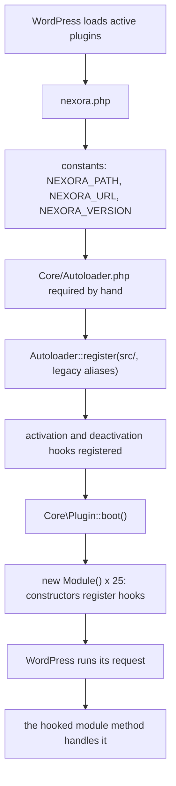
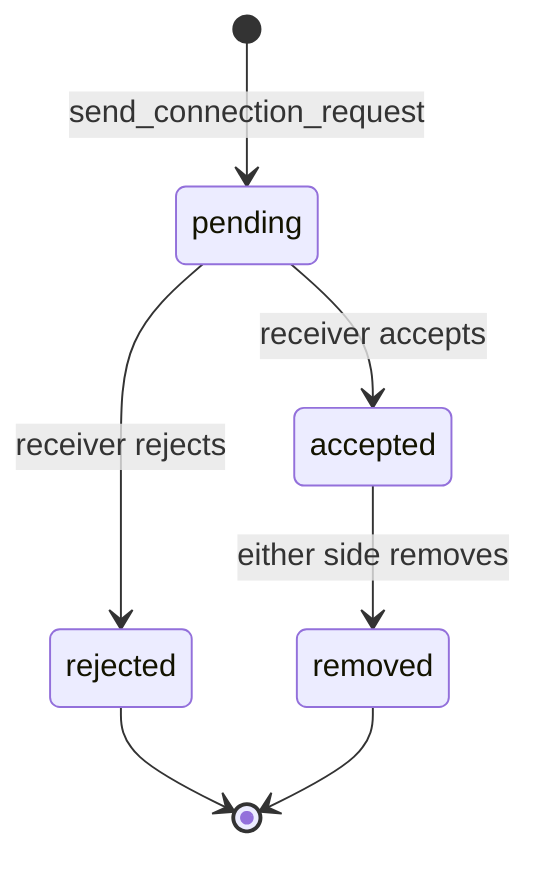
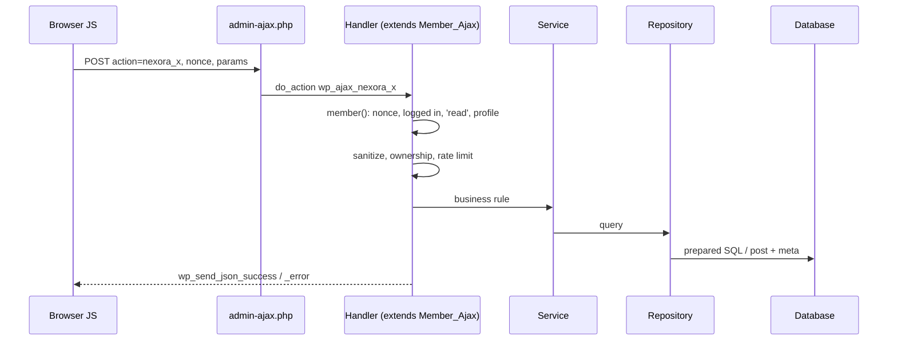
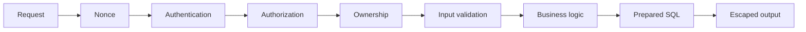
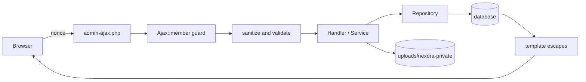

# Nexora developer guide

The single entry point to understanding the Nexora project. It is written for a developer who knows basic PHP and WordPress but did not build Nexora. Everything here was checked against the code on branch `docs/developer-guide`; where something is inferred rather than read directly it says **Needs clarification / inferred from implementation**.

This guide explains the *shape* of the system and how to find your way around. The detail lives in the supporting documents, which this guide links to instead of repeating:

| Document | Read it for |
|---|---|
| [ARCHITECTURE.md](ARCHITECTURE.md) | layers, bootstrap, Composer/autoloading, folder map, request-flow diagrams, module dependencies, decisions, old-vs-new mapping |
| [CODE-REFERENCE.md](CODE-REFERENCE.md) | every class in `src/` with its methods, callers and side effects |
| [AJAX-API.md](AJAX-API.md) | every AJAX action: handler, nonce, input, ownership rules, output; rate-limit buckets; JS map |
| [AUTHENTICATION.md](AUTHENTICATION.md) | registration, login, password-reset OTP, reCAPTCHA, enumeration defences |
| [DATABASE.md](DATABASE.md) | custom tables, post types, every meta key, options, transients, caches, migrations, lifecycle |
| [THEME.md](THEME.md) | the Nexora theme file by file and every plugin/theme integration point |
| [DEVELOPMENT-WORKFLOW.md](DEVELOPMENT-WORKFLOW.md) | tests, PHPCS, daily loop, how-tos, deployment |
| [TROUBLESHOOTING.md](TROUBLESHOOTING.md) | symptom → cause → where to look |

Project rules that predate this guide are in [CLAUDE.md](../CLAUDE.md), the plugin's [README](../wp-content/plugins/nexora/README.md) and the playbooks in [.claude/skills/](../.claude/skills/).

## Contents

1. [What Nexora is](#what-nexora-is)
2. [Project structure](#project-structure)
3. [The plugin, folder by folder](#the-plugin-folder-by-folder)
4. [Boot and lifecycle](#boot-and-lifecycle)
5. [Composer, vendor and PSR-4](#composer-vendor-and-psr-4)
6. [How Nexora uses WordPress](#how-nexora-uses-wordpress)
7. [Plugin versus theme](#plugin-versus-theme)
8. [Data model in one page](#data-model-in-one-page)
9. [Feature walkthroughs](#feature-walkthroughs) (registration, login, OTP, profiles, connections, chat, notifications)
10. [AJAX in brief](#ajax-in-brief)
11. [Templates](#templates)
12. [Shortcodes](#shortcodes)
13. [Hooks](#hooks)
14. [JavaScript](#javascript)
15. [Assets and cache busting](#assets-and-cache-busting)
16. [Security architecture](#security-architecture)
17. [File uploads and private documents](#file-uploads-and-private-documents)
18. [Responses, errors and logging](#responses-errors-and-logging)
19. [Caching](#caching)
20. [Internationalization](#internationalization)
21. [Testing and coding standards](#testing-and-coding-standards)
22. [Extending Nexora](#extending-nexora)
23. [Modifying existing functionality safely](#modifying-existing-functionality-safely)
24. [End-to-end user flows](#end-to-end-user-flows)
25. [Code ownership map](#code-ownership-map)
26. [Where do I go to change X?](#where-do-i-go-to-change-x)
27. [Common mistakes](#common-mistakes)
28. [Deployment](#deployment)
29. [Data-flow map for sensitive information](#data-flow-map-for-sensitive-information)
30. [Glossary](#glossary)
31. [Learning roadmap](#learning-roadmap)
32. [Known gaps and things that do not exist](#known-gaps-and-things-that-do-not-exist)

---

## What Nexora is

Nexora is a **members-only networking site built on WordPress**. A visitor registers, gets a profile, finds other members, sends connection requests, and once a request is accepted the two members can chat privately. Members also publish short posts on their profile and receive notifications about connection activity.

What the pieces provide:

| Part | What it provides |
|---|---|
| Plugin `nexora` | front-end registration and login, password reset by emailed one-time code (OTP), the profile dashboard (info, connections, notifications, posts), the connection workflow, chat, notifications, private ID documents, upload limits, rate limiting, the "Nexora System" admin area, the home-page statistics, a contact form |
| Theme `nexora-theme` | site header, footer, 404, archive/single/search templates, a branding settings page, and an installer that builds sample Elementor pages. It holds no member logic |
| WordPress core | users and passwords, posts and meta, options, hooks, the `admin-ajax.php` endpoint, the media library, rewrite rules |
| Third-party (never edit) | Elementor, Elementor Pro, ACF, and optionally the Better Messages plugin (Nexora only adds one search filter for it, see [Hooks](#hooks)) |

Custom code lives in exactly two places: `wp-content/plugins/nexora/` and `wp-content/themes/nexora-theme/`. The rest of the repository is a committed WordPress install.

## Project structure

```text
nexora/                               repository root = a full WordPress install
├── CLAUDE.md  README.md              project guidance, shortcode table, setup
├── docs/                             this documentation
├── tests/                            WP-CLI test harness
│   ├── run.sh  bootstrap.php  purge.php
│   ├── php/        20 suites (test-*.php)
│   ├── golden/     exact-markup snapshots of every screen
│   ├── child/      scripts for code that ends in exit()
│   └── tools/
├── .claude/skills/                   project playbooks (add module, add endpoint, DB table, ...)
└── wp-content/
    ├── plugins/nexora/               THE PLUGIN
    └── themes/nexora-theme/          THE THEME
```

The plugin (taken from the repository, `vendor/` omitted):

```text
nexora/
├── nexora.php            header, 3 constants, autoloader, activation hooks, Plugin::boot()
├── uninstall.php         gated data removal
├── composer.json  composer.lock  phpcs.xml.dist  README.md
├── languages/nexora.pot
├── assets/
│   ├── css/   tokens.css  style.css  profile-page.css  profile-login.css  profile-registration.css  chat.css
│   ├── js/    profile-page.js  profile-login.js  profile-registration.js  profile-admin.js  chat.js
│   └── lib/sweetalert2/      bundled popup library
├── src/                      all PHP classes, namespace Nexora\  (PSR-4)
│   ├── Core/  Http/  Auth/  Profile/  Connections/  Notifications/  Content/  Chat/
│   └── PostTypes/  Admin/  Shortcodes/  Integrations/  Database/
├── templates/                all HTML: admin/ auth/ chat/ mail/ profile/ shortcodes/
└── vendor/                   dev tooling only (git-ignored), see below
```

The theme is drawn in [THEME.md](THEME.md#2-file-tree).

## The plugin, folder by folder

For every folder: why it exists, what belongs there, and what must not go there. The per-class method tables are in [CODE-REFERENCE.md](CODE-REFERENCE.md).

| Folder | Purpose | Classes | Does **not** belong here |
|---|---|---|---|
| `src/Core/` | plumbing shared by all modules | `Plugin` (composition root), `Autoloader`, `Assets`, `Access_Control`, `Urls`, `View`, `I18n`, `legacy-aliases.php` | feature logic |
| `src/Http/` | one shared way of handling requests | `Ajax` (registrar and the guard `Ajax::member()`), `Member_Ajax` (base class for handlers), `Rate_Limiter` | domain rules |
| `src/Auth/` | getting in | `Registration`, `Login` (login, OTP send/verify, reset), `Otp` (storage rules, no HTTP), `Recaptcha` | profile editing |
| `src/Profile/` | the member's own data and page | `Page`, `Ajax`, `Privacy`, `Fields`, `Repository`, `Private_Documents`, `Upload_Policy`, `Documents_Migration` | connection rules |
| `src/Connections/` | member-to-member relationships | `Ajax`, `Service` (rules), `Repository` (queries), `Cache` | chat |
| `src/Notifications/` | notification rows | `Ajax`, `Repository` | deciding *when* to notify (the caller decides) |
| `src/Content/` | member posts (`user_content`) | `Ajax`, `Repository` | |
| `src/Chat/` | private messaging | `Module` (assets and popup), `Ajax`, `Repository` (four tables) | |
| `src/PostTypes/` | the three custom post types | `Registrar` | |
| `src/Admin/` | the "Nexora System" admin area | `Menu`, `Settings`, `Pages`, `Meta_Boxes`, `List_Columns` | front-end code |
| `src/Shortcodes/` | public shortcodes not owned by another module | `Home`, `Stats`, `Contact_Form` | |
| `src/Integrations/` | third-party plugins | `Better_Messages` | |
| `src/Database/` | schema lifecycle | `Installer`, `Migrations`, `Uninstaller` | feature queries (each module's `Repository` owns those) |
| `templates/` | markup only, escaped where printed | see [Templates](#templates) | queries, business rules |
| `assets/` | CSS and JS | see [Assets](#assets-and-cache-busting) | PHP |
| `languages/` | the `.pot` translation template | | |

The pattern inside a module is always the same: **Ajax (or shortcode class) → Service (rules, where one exists) → Repository (queries) → database**, and the response is JSON or a rendered template. The module dependency diagram, including the two real two-way pairs (`Profile`↔`Connections`, `Profile`↔`Content`) and the fact that `Chat` reads connection post meta directly rather than calling `Connections`, is in [ARCHITECTURE.md](ARCHITECTURE.md#6-dependencies-between-modules). No other circular dependency was found.

## Boot and lifecycle



* [nexora.php](../wp-content/plugins/nexora/nexora.php) holds no logic. `Plugin::boot()` ([src/Core/Plugin.php](../wp-content/plugins/nexora/src/Core/Plugin.php)) is the *composition root*: the one place that creates every module. A module's constructor is where it attaches itself to WordPress with `add_action`, `add_filter`, `add_shortcode` or `Ajax::register`. The creation order is deliberate because hooks fire in registration order. Details and the constants table: [ARCHITECTURE.md](ARCHITECTURE.md#2-bootstrap-from-wordpress-to-your-code).
* **Activation** → `Database\Installer::activate()` → `Migrations::run()` creates the five tables with `dbDelta` and stores `nexora_db_version`.
* **Every request** → on `plugins_loaded`, `Migrations::maybe_upgrade()` compares the stored `nexora_db_version` with the constant `Migrations::DB_VERSION` and upgrades if behind. Migrations are idempotent (`dbDelta` only adds), guarded by a lock option, and fire `nexora_migrated`. Failure behaviour is described (as inferred) in [DATABASE.md](DATABASE.md#7-migrations).
* **Deactivation** → deletes the stored `rewrite_rules` option and the `nexora_home_stats` transient. No data is removed.
* **Uninstall** → `uninstall.php` loads the autoloader and runs `Database\Uninstaller::run()`, which does nothing unless the setting `nexora_delete_data_on_uninstall` is on. It defaults to **off** because the site stores real members' profiles and ID documents; deleting the plugin by accident must not destroy them.

## Composer, vendor and PSR-4

**Why does a plugin that WordPress doesn't need Composer for have a `vendor/` folder?** Because `vendor/` here holds *developer tools only*.

* **Composer** is PHP's package manager. `composer.json` declares what the project needs; `composer.lock` records the exact versions that were resolved so everyone gets identical ones. `composer install` installs what the lock says; `composer update` re-resolves and rewrites the lock, so run it only deliberately.
* Nexora's [composer.json](../wp-content/plugins/nexora/composer.json) says in its own description that Composer is for development tooling and that **production needs no `vendor/`**.
  * `require`: only `php >= 8.0`.
  * `require-dev`: `wp-coding-standards/wpcs` ^3.1, `phpcompatibility/phpcompatibility-wp` ^2.1, `dealerdirect/phpcodesniffer-composer-installer` ^1.0. The lock resolves these (plus their dependencies) to eight packages: `squizlabs/php_codesniffer` 3.13.6, `wp-coding-standards/wpcs` 3.4.1, `phpcompatibility/php-compatibility` 9.3.5, `phpcompatibility/phpcompatibility-paragonie` 1.3.4, `phpcompatibility/phpcompatibility-wp` 2.1.8, `phpcsstandards/phpcsutils` 1.2.3, `phpcsstandards/phpcsextra` 1.5.1, `dealerdirect/phpcodesniffer-composer-installer` v1.2.1. No runtime package exists.
  * `autoload`: `"Nexora\\": "src/"` (PSR-4).
  * `scripts`: `lint` → `phpcs`, `lint:fix` → `phpcbf`, `test` → `../../../../tests/run.sh`.
  * `autoload-dev` does not exist.
* **PSR-4** means *namespace = folder, class name = file name*. Nexora's own loader ([Core/Autoloader.php](../wp-content/plugins/nexora/src/Core/Autoloader.php)) implements it so the plugin works on a server where nobody ran Composer: `Nexora\Core\Plugin` → strip `Nexora\` → `Core/Plugin` → `src/Core/Plugin.php`. The `autoload` block in `composer.json` states the same mapping but is **not used at runtime** (`nexora.php` never requires `vendor/autoload.php`). The loader also maps the pre-refactor global names (`NEXORA_CHAT_DB`, ...) to the new classes through `class_alias()` from [legacy-aliases.php](../wp-content/plugins/nexora/src/Core/legacy-aliases.php).
* `vendor/` contains `autoload.php`, `bin/phpcs`, `bin/phpcbf` and the sniff libraries. It is git-ignored (blanket `vendor/` rule), never deployed, and never edited by hand: delete it and run `composer install` to rebuild.

Full detail: [ARCHITECTURE.md](ARCHITECTURE.md#3-composer-vendor-and-autoloading).

## How Nexora uses WordPress

| WordPress mechanism | Nexora use |
|---|---|
| Actions and filters | modules attach in constructors (full list in [Hooks](#hooks)) |
| Shortcodes | the pages `login-page`, `registration-page`, `profile-page` and the home page are WordPress pages containing Nexora shortcodes ([Shortcodes](#shortcodes)) |
| AJAX | `admin-ajax.php` with `wp_ajax_*` hooks, registered through `Http\Ajax::register` ([AJAX-API.md](AJAX-API.md)) |
| REST API | **none**: no routes registered, post types not exposed |
| Custom post types | `user_profile`, `user_connections`, `user_content` |
| Post meta / user meta | the data model ([DATABASE.md](DATABASE.md)) |
| Options | settings, `nexora_db_version`, fallback rate-limit counters |
| Transients | `nexora_home_stats`, `nexora_otp_ref_<ref>` |
| Object cache | connection and thread lists, rate limits |
| Cron / scheduled events | **none** (no `wp_schedule_event`) |
| Rewrite rules | `^profile-page/([^/]+)/?$` → `index.php?pagename=profile-page&username=$matches[1]` in `Profile\Page::rewrite_rule` |
| WP-CLI | `wp nexora migrate-documents [--dry-run]` (`Profile\Documents_Migration`) |
| Enqueue system | per-page scripts and styles, versioned with `NEXORA_VERSION` |

The layering is: **WordPress core → Nexora plugin (data, rules, shortcodes, AJAX) → Nexora theme (chrome) → browser.** The plugin works with any theme.

## Plugin versus theme

| | Plugin | Theme |
|---|---|---|
| Question it answers | what can members do, and who may do it | what does the page look like around the content |
| Holds | authentication, database operations, relationships, chat, notifications, profile data, privacy | header, footer, templates, branding, sample pages |
| Survives a theme switch | yes | n/a |

Authentication, relationships, chat, notifications and profile data belong in the plugin because they are *the product*; a theme is meant to be replaceable and a switch must not lose logins or messages. Security rules (nonces, ownership, private fields) must also live where one audited place enforces them.

If the theme is switched, everything functional keeps working; the plugin pages render inside the new theme's `the_content()`. Lost: the `nxt_settings` branding values and the `[nxt_*]` shortcodes. The new site needs pages with the slugs `login-page`, `registration-page`, `profile-page` containing the right shortcodes, and the permalinks re-saved. The plugin/theme integration table (eight boundaries, what crosses each and what breaks) is in [THEME.md](THEME.md#5-where-plugin-and-theme-meet). The theme has **no dependency on plugin PHP classes**, only on shortcode names and the fixed page paths.

## Data model in one page

Full detail: [DATABASE.md](DATABASE.md).

| Kind | Items |
|---|---|
| Custom post types (`PostTypes\Registrar`, all `public => false`, under the "Nexora System" menu, no REST, no taxonomies) | `user_profile`, `user_connections`, `user_content` |
| Custom tables (`{prefix}…`, created by `dbDelta`) | `nexora_notifications`, `nexora_threads`, `nexora_thread_participants`, `nexora_messages`, `nexora_message_meta` |
| User meta | `_profile_id` (user → profile post), `reset_otp`, `otp_expiry`, `otp_attempts`, `reset_token`, `reset_token_expiry` |
| Key profile post meta | `_wp_user_id` (profile → user), contact/address/work fields, `profile_image`, `cover_image`, `aadhaar_card`, `driving_license`, `company_id_card` |
| Key connection post meta | `sender_user_id`, `sender_profile_id`, `receiver_user_id`, `receiver_profile_id`, `status` (`pending`, `accepted`, `rejected`, `removed`) |
| Options | `nexora_db_version`, `nexora_delete_data_on_uninstall`, reCAPTCHA keys, default images, home texts |

The **two-way link** user ↔ profile (`_profile_id` user meta and `_wp_user_id` post meta) is the backbone of every ownership check: the handler takes the user from the session, reads `_profile_id`, and only ever touches that profile.

## Feature walkthroughs

Concept → file → method → data → result. Auth detail is in [AUTHENTICATION.md](AUTHENTICATION.md).

### Registration

`profile-registration.js` posts `nexora_profile_register` → `Auth\Registration::registration_form_handle` → nonce → `Rate_Limiter::blocked('register')` → `Recaptcha::verify` → `read_input()` sanitizes → `validate()` → `wp_create_user` (WordPress hashes the password; Nexora never sanitizes or stores it) → `wp_insert_post` of a `user_profile` → write `_wp_user_id` / `_profile_id` → admin notification mail → auto-login → JSON `{message, redirect}`. If the profile post cannot be created the new user is deleted. **There is no email verification and no OTP at signup.**

### Login and logout

`Auth\Login::handle_login` (`nexora_profile_login`): nonce, limiter `login`, reCAPTCHA, optional email→login lookup, `wp_signon`. Every failure returns the same message ("Invalid username or password"). Logout is WordPress's own `wp_logout_url`.

### OTP (password reset only)

`send_otp` → `Otp::issue` stores a **hash** of a `random_int(100000, 999999)` code in user meta `reset_otp` with `otp_expiry` (10 minutes) and `otp_attempts`; the browser receives only an **opaque 32-hex reference** (transient `nexora_otp_ref_<ref>`, 25 minutes), never the user id. `verify_otp` allows 5 wrong tries, then issues a hashed single-use reset token (10 minutes). `reset_password` checks the token, sets the password, clears all OTP state and logs the member in. Unknown accounts get an identical reply. State diagram and every constant: [AUTHENTICATION.md](AUTHENTICATION.md#4-password-reset-with-otp).

### Profiles

The profile page is the shortcode `[profile_dashboard]` on the page `profile-page`. `Page::render_profile()` decides: guest → `profile/guest-wall`; administrator → `profile/admin-mode`; no `username` → own profile; unknown `username` → `profile/not-found`; otherwise `Privacy::role(current, owner)` (`guest`, `viewer` or `owner`) selects what data is built. Private fields (email, phone, gender, birthdate, LinkedIn, address, work, ID documents) are filled **only for the owner**, both in the server-rendered HTML and in the `profilePageData` object handed to JavaScript (`Privacy::script_data`). Field lists are the constants in `Profile\Fields`. Editing goes through `Profile\Ajax` and writes only the session user's profile.

### Connections



`Connections\Service` holds the rules: the caller must be sender or receiver; only the **receiver** of a **pending** request may accept or reject; only an **accepted** connection can be removed; removing closes the connection's chat threads (`Chat\Repository::inactive_threads_by_connection`); each change writes a notification for the other party. A new request is refused if an active connection already exists. Statuses are stored in the `status` post meta of a `user_connections` post (title `a->b`). Whether a `rejected`/`removed` pair may send a fresh request is decided by `Repository::active_between()`; **Needs clarification / inferred from implementation**: read that method before depending on re-requests.

### Chat

Four tables. `nexora_thread_participants` is the **authorization source**: `Chat\Repository::is_user_in_thread()` asks whether `(thread_id, user_id)` exists. Every endpoint that takes a `thread_id` calls `Chat\Ajax::require_participant()` with the user id from the **session**. A thread is created only between the two parties of an `accepted` connection. Sending requires an `active` thread, limits the text to 2,000 characters and is rate-limited to 30 per minute per user; it inserts the message, updates the thread, adds 1 to the other participant's `unread_count`, and invalidates the cached thread list. Reading marks the thread read for the caller. The popup is printed in `wp_footer`/`admin_footer` by `Chat\Module`; `chat.js` polls every 3 seconds. Admin sees chats in the connection meta boxes. Endpoint list: [AJAX-API.md](AJAX-API.md#3-chat-endpoints-nonce-nexora_chat_nonce).

### Notifications

Table `nexora_notifications` (`type` is `request`, `accepted`, `rejected` or `removed`; `is_read` 0/1; the English `message` is stored at write time and not translated later). `Notifications\Repository::insert` is called by `Connections\Service`. `nexora_mark_notification_read` requires the row's `receiver_user_id` to equal the session user. The profile's notifications tab renders from the repository (`templates/profile/tab-notifications.php`). There is no delete endpoint.

## AJAX in brief

Every endpoint, with its nonce, rules and output, is tabulated in [AJAX-API.md](AJAX-API.md) (15 member endpoints, 8 chat endpoints, 5 guest endpoints; plus the document download and the contact form `admin-post` handler). The mechanics:



`Http\Ajax::register('name', $cb, $guest)` creates `wp_ajax_nexora_name` plus a deprecated alias `wp_ajax_name` that fires `nexora_deprecated_ajax_action`. Chat registers its prefixed names directly. A **nonce is not authorization**: it proves the request came from a page Nexora rendered; the handler then checks login, and each handler checks that the user may touch *that* object.

## Templates

`templates/` holds markup only. `Core\View::render('profile/page', $vars)` includes the file inside an output buffer with `$vars` extracted as local variables (`EXTR_SKIP`); `View::output()` echoes it. Classes prepare the data, the template escapes everything it prints (`esc_html`, `esc_attr`, `esc_url`). HTML was moved out of PHP classes so that escaping sits in one visible place, markup is diffable, and the golden snapshots in `tests/golden/` can pin it.

| Folder | Templates | Rendered by |
|---|---|---|
| `auth/` | `login-form`, `login-state`, `registration-form`, `registration-state` | `Auth\Login::login_form`, `Auth\Registration::registration_form` |
| `profile/` | `page`, `tab-info`, `tab-connections`, `tab-content`, `tab-notifications`, `guest-wall`, `admin-mode`, `not-found`, `history`, `history-card`, `connection-cards`, `content-history` | `Profile\Page`; the last four also returned as HTML by `Connections\Ajax` and `Content\Ajax` |
| `chat/` | `layout`, `sidebar`, `box` | `Chat\Module::load_chat_template` |
| `shortcodes/` | `home`, `contact-form` | `Shortcodes\Home`, `Shortcodes\Contact_Form` |
| `mail/` | `admin-new-member`, `password-reset-success` | `Auth\Registration`, `Auth\Login` |
| `admin/` | `settings`, `chat`, `notifications`, `metabox-*` (address, connection, connection-chat, connections, content, contents, documents, personal, user-chat, work) | `Admin\Settings`, `Admin\Pages`, `Admin\Meta_Boxes` |

Variables are documented in the `@var` block at the top of the templates that take any (for example `shortcodes/home.php` lists `$logged_in`, `$stats`, `$features`, ...; `admin/settings.php` lists `$images`, `$v`). For the rest, read the calling class: the variables are the array it passes to `View::render`. **Needs clarification:** several `profile/` and `auth/` templates have no `@var` block, so their variables must be read from the caller. The rule for any new template: prepare data in the class, escape in the template, no queries.

## Shortcodes

| Shortcode | Purpose | Attributes | Class / template | Data and permissions |
|---|---|---|---|---|
| `[profile_registration]` | registration form | none | `Auth\Registration::registration_form` → `auth/registration-form` (or `registration-state` when logged in) | public |
| `[profile_login]` | login form with OTP/reset popups | none | `Auth\Login::login_form` → `auth/login-form` / `login-state` | public |
| `[profile_dashboard]` | profile page | none (`username` comes from the rewrite rule) | `Profile\Page::render_profile` → `profile/*`; returns `''` unless the page slug is `profile-page` | guest wall / viewer / owner as above |
| `[nexora_home]` | marketing home page | none | `Shortcodes\Home::render_home_page` → `shortcodes/home` | public; stats from the cached `Home::get_stats()` |
| `[nexora_stat]` | one statistic as text | `type` (default `members`; others from `get_stats()`: connections, posts, chats) | `Shortcodes\Stats::stat` | public; unknown type returns `''` |
| `[nexora_auth_buttons]` | Log in / Sign up, or profile link and Log out | none | `Shortcodes\Stats::auth_buttons` (inline HTML) | public |
| `[nexora_contact_form]` | contact form | none | `Shortcodes\Contact_Form::render` → `shortcodes/contact-form` | public; posts to `admin-post.php` (action `nexora_contact`) with nonce, honeypot and limiter |

Theme-owned shortcodes (`[nxt_logo]`, `[nxt_setting]`, `[nxt_year]`) are in [THEME.md](THEME.md#4-elementor-integration). Flow: page → shortcode tag → the class method → (service/repository) → `View::render` → HTML in `the_content()`.

## Hooks

Registered by Nexora (grepped from `src/`). Hooks Nexora *fires* for others are in the second table.

| Hook | Registered by | Purpose |
|---|---|---|
| `plugins_loaded` | `Database\Migrations` | run pending schema upgrade |
| `init` | `Core\I18n` (priority 0, load text domain), `PostTypes\Registrar` (CPTs), `Profile\Page` (rewrite rule), `Core\Access_Control::block_wp_login`, `Profile\Upload_Policy` (one-time capability cleanup) | |
| `after_setup_theme` | `Core\Access_Control::hide_admin_bar` | hide the admin bar for non-admins |
| `admin_init` | `Admin\Settings` (register settings), `Core\Access_Control::block_wp_admin` | |
| `admin_menu`, `admin_enqueue_scripts`, `add_meta_boxes`, `save_post` | `Admin\Menu`, `Admin\Meta_Boxes` | admin UI |
| `manage_{cpt}_posts_columns` / `_custom_column` | `Admin\List_Columns` | list columns for the three CPTs |
| `wp_enqueue_scripts` | `Core\Assets`, `Profile\Page`, `Auth\Login`, `Auth\Registration`, `Chat\Module` | per-page assets |
| `wp_footer`, `admin_footer` | `Chat\Module` | print the chat popup |
| `wp_ajax_*`, `wp_ajax_nopriv_*` | `Http\Ajax::register` (all modules), `Chat\Ajax`, `Profile\Private_Documents` (`nexora_document`) | AJAX |
| `admin_post_nopriv_nexora_contact`, `admin_post_nexora_contact` | `Shortcodes\Contact_Form` | contact form POST |
| `query_vars` | `Profile\Page` | adds `username` |
| `login_redirect` | `Core\Access_Control` | send members to their profile |
| `user_register`, `deleted_user`, `save_post_user_connections`, `save_post_user_content`, `save_post_user_profile` | `Shortcodes\Home` | flush the stats transient |
| `added_post_meta`, `updated_post_meta`, `deleted_post_meta`, `transition_post_status`, `deleted_post` | `Connections\Cache` | invalidate connection lists |
| `added_post_meta`, `updated_post_meta` | `Profile\Private_Documents` | move a newly assigned ID document to the private folder |
| `wp_get_attachment_url`, `wp_get_attachment_image_src`, `wp_prepare_attachment_for_js`, `wp_calculate_image_srcset` | `Profile\Private_Documents` | rewrite private file URLs to the gated download |
| `user_has_cap`, `upload_size_limit`, `wp_handle_upload_prefilter`, `ajax_query_attachments_args`, `upload_mimes` | `Profile\Upload_Policy` | upload rules for members |
| `better_messages_search_user_sql_condition` | `Integrations\Better_Messages` | limit the third-party search to accepted connections |

Nexora's own hooks:

| Hook | Kind | Where | Purpose |
|---|---|---|---|
| `nexora_deprecated_ajax_action` | action | `Http\Ajax` | an old un-prefixed AJAX name was used |
| `nexora_migrated` | action | `Database\Migrations` | schema upgraded (`$from`, `$to`) |
| `nexora_rate_limits` | filter | `Http\Rate_Limiter` | change bucket limits |
| `nexora_client_ip_header` | filter | `Http\Rate_Limiter` | trusted proxy header for the client IP (or the constant `NEXORA_CLIENT_IP_HEADER`) |
| `nexora_skip_captcha`, `nexora_captcha_site_host`, `nexora_captcha_host_ip` | filters | `Auth\Recaptcha` | local-site captcha policy |
| `nexora_member_max_upload_bytes`, `nexora_member_max_files` | filters | `Profile\Upload_Policy` | member upload limits |
| `nexora_document_headers` | filter | `Profile\Private_Documents` | response headers of a document download |

## JavaScript

All Nexora JS is jQuery over `admin-ajax.php`; there is no build step. Data and the nonce reach the browser through `wp_localize_script`. The full file-to-action map is in [AJAX-API.md](AJAX-API.md#7-javascript-map).

| File | Lines | Role |
|---|---|---|
| `profile-page.js` | 939 | dashboard: tabs, edit forms, media picker, connections, history, notifications, posts. Object `profilePageData` |
| `chat.js` | 659 | popup chat; object `nexoraChat` (`ajax_url`, `user_id`, `nonce`); 3-second polling; escapes with `nxEsc()` |
| `profile-login.js` | 304 | login, OTP and reset popups (SweetAlert2) |
| `profile-registration.js` | 92 | registration submit |
| `profile-admin.js` | 58 | admin meta-box media buttons |

Pattern: event handler → `$.post(ajaxUrl, {action, nonce, ...})` → `response.success` true → update the DOM (interpolated text goes through an escape helper, server-rendered HTML is inserted as returned); `false` → show `response.data` as the message. Business errors arrive as HTTP 200 with `success:false`.

## Assets and cache busting

* CSS: `tokens.css` (design tokens, enqueued by `Core\Assets::enqueue_tokens()`, and loads the Plus Jakarta Sans font itself when the active theme is not `nexora-theme`), `style.css` (global, every front-end page), and one stylesheet per feature, loaded only where needed. Prefix `nx-*` for the plugin, `nxt-*` for theme chrome, `nxe-*` for Elementor sections.
* JS and CSS of a feature load only on its page: `Core\Assets::is_page_for($slug, $shortcode)` is true when the singular page has that slug, contains the shortcode, or (for Elementor pages) the `_elementor_data` meta contains it.
* Every plugin asset is enqueued with `NEXORA_VERSION` as its version, so **bumping `NEXORA_VERSION` in `nexora.php` changes every `?ver=` query string** and forces browsers and CDNs to refetch. Theme assets use `NXT_VERSION` in the same way. Bump after any CSS/JS change (the `nexora-release-assets` skill makes this a checklist item).

## Security architecture

Request pipeline every endpoint passes through:



The three ideas people confuse:

* **Authentication**: who are you? `is_user_logged_in()` inside `Http\Ajax::member()`.
* **Authorization**: are you allowed to do this kind of thing? `current_user_can('read')`, `manage_options` for admin-only paths, "only the receiver of a pending request may accept it" in `Connections\Service`.
* **Ownership**: does this *particular object* belong to you? Examples: `Privacy::role()` (owner of the profile); `Private_Documents::can_view()` (owner or admin); chat `require_participant()`; `nexora_mark_notification_read` comparing `receiver_user_id`; an attachment id in a profile form must belong to the user.

| Threat | Defence in Nexora | Where |
|---|---|---|
| CSRF | nonce checked once, centrally: `profile_nonce` (members and guests), `nexora_chat_nonce` (chat); contact form has its own nonce field | `Http\Ajax::member()`, `check_ajax_referer` in guest handlers, `Chat\Ajax::authorize` |
| IDOR (changing an id to see someone else's data) | the acting user and profile come from the session, never the request; ids from the browser are re-checked against ownership or participation | `Member_Ajax`, `Chat\Ajax::require_participant`, `Connections\Service` |
| SQL injection | WordPress APIs or `$wpdb->prepare()`; table names are `$wpdb->prefix` plus constants | each `Repository` |
| XSS | escaping in templates; JS escapes interpolated text (`esc()`, `nxEsc()`); inputs sanitized on write | `templates/`, `assets/js/` |
| Privilege escalation | members have `read` only; `upload_files` is granted per request, only on the profile page or the uploader's AJAX; admins are bounced out of nothing, members out of `wp-admin` | `Profile\Upload_Policy`, `Core\Access_Control` |
| Unauthorized profile access | private fields only for the owner, in HTML and in JS data; guests get a login prompt | `Profile\Privacy`, `Profile\Fields::owner_only()` |
| Unauthorized chat access | participant table check on every thread endpoint; user ids from the session | `Chat\Ajax`, `Chat\Repository::is_user_in_thread` |
| Unauthorized document access | files moved to `uploads/nexora-private/`, served only to owner/admin | `Profile\Private_Documents` |
| OTP brute force | hashed 6-digit code, 10-minute life, 5 attempts per code, 20 verifications / 15 min / IP | `Auth\Otp`, `Rate_Limiter` |
| Account enumeration | identical replies for login failures and forgot-password; opaque OTP references. **Remaining:** registration says "User already exists" | `Auth\Login`, `Auth\Otp::issue_ref` |
| Malicious uploads | members: images and PDF only, 8 MB, 100 files, own files only | `Profile\Upload_Policy` |
| Unauthorized AJAX | every action is listed in `tests/php/test-endpoint-matrix.php`, which fails if one is registered but not listed | tests |
| Abuse | fixed-window limiter per IP or user | `Http\Rate_Limiter` |

Details of the OTP and enumeration reasoning: [AUTHENTICATION.md](AUTHENTICATION.md#8-enumeration-and-brute-force). Layer summary, as a checklist for new code: nonce → login → capability → ownership → sanitize and validate → prepared SQL → escape on output. Every layer exists because the previous one only proves something narrower (a nonce proves origin, not identity; login proves identity, not rights; rights do not prove ownership of this record).

## File uploads and private documents

Members upload through the WordPress media library, opened from the profile page. Rules come from `Profile\Upload_Policy`, applied only to users without `manage_options`:

| Rule | Value | Mechanism |
|---|---|---|
| Allowed types | `jpg/jpeg/jpe`, `png`, `gif`, `webp`, `pdf` | `upload_mimes` filter |
| Maximum size | 8 MB (`DEFAULT_MAX_BYTES`); filter `nexora_member_max_upload_bytes` | `upload_size_limit`, `wp_handle_upload_prefilter` |
| Maximum files | 100 attachments per author (`DEFAULT_MAX_FILES`); filter `nexora_member_max_files` | `wp_handle_upload_prefilter` counts the author's attachments |
| Who may upload | a user with a linked profile, only while the request is the profile page or the uploader's AJAX actions (`upload-attachment`, `query-attachments`, `get-attachment`) | `user_has_cap` filter |
| Library visibility | a member's library shows only their own files | `ajax_query_attachments_args` |

**ID documents** (`aadhaar_card`, `driving_license`, `company_id_card` profile meta, an attachment id each): when an attachment id is saved into one of those keys, `Private_Documents::on_meta_change` calls `protect()` which moves the file and its sizes into `uploads/nexora-private/` and flags the attachment with post meta `_nexora_private`. URL filters then rewrite every URL of a flagged file to `admin-ajax.php?action=nexora_document&id=<attachment>[&size=]`. `serve()` requires login (401), `can_view()` (403: administrator, the owner whose profile references it, or the uploading author) and an existing file (404), and sends `X-Content-Type-Options: nosniff` and private no-store caching. So a direct URL under `uploads/` cannot expose a document, and a leaked download link is useless to anyone else. The profile and cover image (`PUBLIC_KEYS`) stay public, and `Profile\Ajax::update_documents_info` refuses to turn a private document into a public image or the reverse. Older public files are moved by `wp nexora migrate-documents [--dry-run]`. Replacing a document = saving a new attachment id; removing = saving an empty value.

**Needs clarification / inferred from implementation:** whether the web server also blocks direct access to `uploads/nexora-private/` (for example by an `.htaccess` or server rule) is a deployment setting; read `Private_Documents::ensure_dir()` to see what the plugin itself writes there and check the host's configuration.

## Responses, errors and logging

Every AJAX handler ends in exactly one `wp_send_json_success($data)` → `{"success":true,"data":…}` or `wp_send_json_error($message)` → `{"success":false,"data":"…"}`. Both are HTTP 200; the front end tests `response.success`. A failed nonce makes WordPress answer `-1` with 403, and an unregistered action answers `0`. The document download uses real 401/403/404 codes. Real examples are in [AJAX-API.md](AJAX-API.md#6-response-format).

`WP_Error` and exceptions are not the project's error vocabulary for the web layer; handlers return JSON messages. **Needs clarification:** there is no dedicated Nexora logger. For debugging, set `WP_DEBUG` and `WP_DEBUG_LOG` in your local `wp-config.php` and read `wp-content/debug.log`; never show errors on production. The `wp_mail()` return value is not checked by the OTP code (`Auth\Login::send_otp`), so a mail failure is not shown to the member.

## Caching

| Cache | Key | TTL | Invalidated by |
|---|---|---|---|
| Transient `nexora_home_stats` | – | 1 h | `user_register`, `deleted_user`, `save_post_user_*` |
| Object cache group `nexora_connections` | `ids_/pairs_/blocked_<profile>_<version>` | 1 h | `Connections\Cache` bumps `version` on connection meta changes, status transitions, deletes |
| Object cache group `nexora_chat` | `threads_<user>_<version>` | 1 h | every `Chat\Repository` write bumps `version` |
| `nexora_rl` group or options `nexora_rl_*` | per bucket, window | the window | expiry |

Invalidation matters because a stale connection list would let chat search show a removed connection (a privacy problem) and a stale thread list would show wrong unread counts. The version stamp in the key makes old entries unreachable at once. Without a persistent object cache (Redis, Memcached) the object-cache layers only last one request. Always write through the repositories so the invalidation runs. More in [DATABASE.md](DATABASE.md#9-caching).

## Internationalization

Text domain **`nexora`** (plugin header `Text Domain: nexora`, `Domain Path: /languages`); `Core\I18n` loads it on `init` priority 0. Wrap every user-facing PHP/template string in `__()`, `esc_html__()`, `esc_html_e()` or `esc_attr__()` with that domain, then regenerate `languages/nexora.pot` (command in the plugin README). `tests/php/test-i18n.php` fails on untranslated text or a stale `.pot`. Notification messages are stored in English in the database at write time. The theme uses its own domain, `nexora-theme`.

## Testing and coding standards

* `tests/run.sh [file…]` runs, from the repository root: `wp eval-file tests/purge.php` (removes leftover `nxtest_*` fixtures), then `wp eval-file` for every `tests/php/test-*.php` (or the files given), and exits non-zero if any suite failed. It needs WP-CLI and the local dev database; fixtures clean up after themselves. The helpers are in `tests/bootstrap.php`. Suite list and what each proves: [DEVELOPMENT-WORKFLOW.md](DEVELOPMENT-WORKFLOW.md#2-tests).
* **Red → green → refactor**: write a test that fails for the right reason, write the minimum code, then clean up with the suite as the safety net. During the refactor, characterization tests pinned the old behaviour first, and `test-golden-output.php` kept every screen's markup byte-identical.
* **PHPCS**: `cd wp-content/plugins/nexora && composer install && vendor/bin/phpcs` must print nothing (`vendor/bin/phpcbf` auto-fixes). Config: [phpcs.xml.dist](../wp-content/plugins/nexora/phpcs.xml.dist) (WordPress standard, PHPCompatibilityWP for PHP 8.0+, scans `nexora.php`, `src/`, `templates/`).
* Syntax: `find wp-content/plugins/nexora wp-content/themes/nexora-theme -name '*.php' -print0 | xargs -0 -n1 php -l | grep -v '^No syntax errors'`.
* **Before committing:** `tests/run.sh`, `vendor/bin/phpcs`, the `php -l` command, then the `nexora-release-assets` checklist.

## Extending Nexora

Each has a playbook in [.claude/skills/](../.claude/skills/); the steps are in [DEVELOPMENT-WORKFLOW.md](DEVELOPMENT-WORKFLOW.md#5-add-a-module). In short:

* **New module**: one class `src/<Module>/<Class>.php` in namespace `Nexora\<Module>` (the file name must match the class), a constructor that registers its hooks, one `new` line in `Plugin::boot()` (no `require`), templates under `templates/`, assets enqueued with `NEXORA_VERSION`, a test.
* **New AJAX endpoint**: extend `Member_Ajax`, register with `Ajax::register('name', …)`, start with `$this->member()`, take ids as `absint`, check ownership, rate-limit anything abusable with `Rate_Limiter::hit`, call a service/repository, end with `wp_send_json_*`; add the action to the manifest in `test-endpoint-matrix.php`, call it from JS with the localized nonce, and update [AJAX-API.md](AJAX-API.md).
* **New database change**: edit the repository's `create_table()` SQL in `dbDelta` format, bump `Migrations::DB_VERSION`, test on a copy of an existing database (idempotence), document in [DATABASE.md](DATABASE.md). Never bypass `Migrations` with ad-hoc `CREATE TABLE`.

## Modifying existing functionality safely

The live site holds real data and real cached pages. These names are a **contract** (`tests/php/test-compat-contract.php` enforces many of them) and must not be renamed casually:

| What | Why |
|---|---|
| Shortcode tags (`profile_login`, `profile_registration`, `profile_dashboard`, `nexora_home`, `nexora_stat`, `nexora_auth_buttons`, `nexora_contact_form`) | stored inside page content and Elementor data |
| Page slugs `login-page`, `registration-page`, `profile-page`, and the `profile-page/<username>` rewrite | URLs, theme links, `Core\Urls`, asset loading |
| Post type names and **every** meta key | existing rows; profile/connection/content data |
| Table and column names | existing data; `dbDelta` would create a *new* table or column instead of renaming |
| Option names and transient names | stored settings |
| AJAX action names | the `nexora_` names are current; the un-prefixed aliases serve cached pages with old JS. Do not remove an alias until `nexora_deprecated_ajax_action` shows no traffic |
| Class names | old global names are aliased; third-party code may use them |

When you must change one: add the new name, keep the old one working, migrate data in a versioned migration, update the compat-contract test, and document it.

## End-to-end user flows

| Flow | Files and methods |
|---|---|
| Registration | `templates/auth/registration-form.php` on the `registration-page` → `profile-registration.js` → `nexora_profile_register` → `Auth\Registration::registration_form_handle` (`read_input`, `validate`, `create_member`, `send_admin_notification`) → `user_profile` post + user meta → redirect to `/profile-page/<username>` |
| Login | `profile-login.js` → `nexora_profile_login` → `Auth\Login::handle_login` → `wp_signon` → `Core\Urls::profile_for` |
| Password reset (OTP) | `profile-login.js` `showOtpPopup` / `showResetPasswordPopup` → `send_otp` → `verify_otp` → `reset_password` → `Auth\Otp` → mail template `mail/password-reset-success` |
| View profile | rewrite rule → `[profile_dashboard]` → `Profile\Page::render_profile` → `Privacy::role` → `profile/page` + tabs |
| Edit profile | `profile-page.js` → `nexora_update_*` → `Profile\Ajax` → `Profile\Fields` lists → `update_post_meta` on the session user's profile |
| Send connection | `nexora_get_add_new_users` → `nexora_send_connection_request` → `Connections\Ajax` → `Service::send_request` → `Repository::create_pending` → `Notifications\Repository::insert` |
| Accept connection | `nexora_get_requests` → `nexora_update_connection_status` → `Service::change_status` → notification to sender |
| Send chat message | `chat.js` → `nexora_send_message` → `Chat\Ajax::send_message` → `Chat\Repository::send_message` |
| Read chat | `nexora_get_user_threads`, `nexora_get_messages` → `Chat\Repository` (marks read) |
| Notifications | `Notifications\Repository` rows → tab render → `nexora_mark_notification_read` |
| Home statistics | `[nexora_home]` / `[nexora_stat]` → `Shortcodes\Home::get_stats` (transient) |
| Contact form | `[nexora_contact_form]` → POST `admin-post.php?action=nexora_contact` → `Contact_Form::handle` (nonce, honeypot, limiter, mail, redirect) |

Diagrams for a normal page, an AJAX call, a profile request and a chat request are in [ARCHITECTURE.md](ARCHITECTURE.md#5-request-flows).

## Code ownership map

| Responsibility | Location |
|---|---|
| Bootstrap | `nexora.php`, `src/Core/Plugin.php`, `src/Core/Autoloader.php` |
| Authentication | `src/Auth/Login.php`, `Registration.php`, `Recaptcha.php` |
| OTP | `src/Auth/Otp.php` (+ `Login::send_otp/verify_otp/reset_password`) |
| Access control / URLs | `src/Core/Access_Control.php`, `src/Core/Urls.php` |
| Profiles and privacy | `src/Profile/*` |
| Connections | `src/Connections/*` |
| Chat | `src/Chat/*` |
| Notifications | `src/Notifications/*` |
| Member posts | `src/Content/*` |
| Database lifecycle | `src/Database/*`, each `Repository::create_table()` |
| AJAX plumbing | `src/Http/*` |
| Templates | `templates/`, `src/Core/View.php` |
| Admin screens | `src/Admin/*`, `templates/admin/` |
| Theme | `wp-content/themes/nexora-theme/` |
| Assets | `assets/css`, `assets/js`, `src/Core/Assets.php` |
| Tests | `tests/` |
| Project playbooks | `.claude/skills/` |

## Where do I go to change X?

| I want to… | Start here | Then inspect |
|---|---|---|
| Change login | `src/Auth/Login.php` (`handle_login`) | `templates/auth/login-form.php`, `assets/js/profile-login.js`, `Core\Urls`, `test-auth-ajax.php` |
| Change registration | `src/Auth/Registration.php` (`validate`, `create_member`) | `templates/auth/registration-form.php`, `profile-registration.js`, golden tests |
| Change OTP | `src/Auth/Otp.php` (constants `OTP_TTL`, `MAX_ATTEMPTS`, `TOKEN_TTL`) | `Auth\Login`, `Rate_Limiter` buckets, `test-auth-ajax.php` |
| Change profile fields | `src/Profile/Fields.php` | `Profile\Ajax`, `Profile\Page`, `Profile\Privacy`, `templates/profile/tab-info.php`, `Admin\Meta_Boxes`, the `nexora-data-model` skill |
| Change the profile page | `src/Profile/Page.php`, `templates/profile/` | `profile-page.js`, `profile-page.css`, goldens |
| Change connection logic | `src/Connections/Service.php` | `Repository`, `Cache`, `Notifications\Repository`, `Chat\Repository` |
| Change chat | `src/Chat/Ajax.php`, `Repository.php` | `templates/chat/`, `chat.js`, `chat.css`, `test-chat-ajax.php` |
| Change notifications | `src/Notifications/Repository.php` | callers in `Connections\Service`, `templates/profile/tab-notifications.php` |
| Change AJAX behaviour | `src/Http/Ajax.php`, the module's `Ajax` class | `Member_Ajax`, `Rate_Limiter`, `test-endpoint-matrix.php`, [AJAX-API.md](AJAX-API.md) |
| Change the database | the repository's `create_table()` | `Database\Migrations::DB_VERSION`, [DATABASE.md](DATABASE.md), `test-lifecycle.php` |
| Change front-end HTML | `templates/` | the calling class's data array, `tests/golden/` |
| Change CSS | `assets/css/*.css` (tokens in `tokens.css`) | bump `NEXORA_VERSION` |
| Change JS | `assets/js/*.js` | the localized object in the PHP enqueue, bump `NEXORA_VERSION` |
| Add a shortcode | a class in `src/Shortcodes/` + `Plugin::boot()` | `nexora-add-module` skill, `test-compat-contract.php` |
| Add an AJAX endpoint | `nexora-add-ajax-endpoint` skill | `test-endpoint-matrix.php` |
| Add a migration | `Database\Migrations` + the repository | `nexora-db-table` skill |
| Change rate limits | `Rate_Limiter::defaults()` or the `nexora_rate_limits` filter | [AJAX-API.md](AJAX-API.md#the-standard-guard) |
| Change upload rules | `src/Profile/Upload_Policy.php` | `test-upload-limits.php` |
| Change an admin setting | `src/Admin/Settings.php`, `templates/admin/settings.php` | `nexora-settings-option` skill |
| Change the theme header | `wp-content/themes/nexora-theme/header.php` (or the Elementor Theme Builder header) | `inc/elementor/templates.php`, `assets/css/style.css`, bump `NXT_VERSION` |
| Change the theme footer | `footer.php` (or Theme Builder footer) | same |

## Common mistakes

* Putting business logic or `$wpdb` queries in templates, or bypassing a `Repository` (the caches are invalidated only through them).
* Skipping the nonce, or treating it as authorization. Trusting an id from the browser instead of the session or an ownership check.
* Adding a private field to what non-owners receive (`Privacy`, `Fields::owner_only()`), or linking an ID document to a public field.
* Editing `vendor/`, or running `composer update` casually (it rewrites the lock). Production does not need `vendor/`.
* Renaming a table, column, meta key, option, shortcode, slug or AJAX name; removing a deprecated AJAX alias early.
* "Tidying" `dbDelta` SQL (it needs `PRIMARY KEY` followed by two spaces, `KEY` not `INDEX`, one column per line).
* Changing CSS/JS without bumping `NEXORA_VERSION` (users keep the old file).
* Changing markup without regenerating and reviewing the golden snapshots; untranslated strings; editing third-party code (WordPress, Elementor, ACF).
* Adding a module without its `new` line in `Plugin::boot()`.

## Deployment

The authoritative checklist is in [DEVELOPMENT-WORKFLOW.md](DEVELOPMENT-WORKFLOW.md#9-deployment). Outline: tests → PHPCS → `php -l` → review → PR → merge → **back up the database** → deploy → the migration runs itself on the first request (verify `nexora_db_version` and the tables) → re-save *Settings → Permalinks* if rewrites changed → flush page/CDN caches (bumped asset versions help) → smoke test (register, log in, profile, connect, chat, an ID document download). Deploy `nexora.php`, `uninstall.php`, `src/`, `templates/`, `assets/`, `languages/`. Do **not** deploy `vendor/`, `tests/`, `composer.*`, `phpcs.xml.dist`, `wp-config.php`, uploads or database dumps. Rollback: restore the backup; the schema only ever gains tables, columns and indexes, so older code runs against a newer schema.

## Data-flow map for sensitive information



| Data | Stored | Protection |
|---|---|---|
| Password | `wp_users.user_pass`, hashed by WordPress | never sanitized or logged by Nexora; `wp_set_password` / `wp_create_user` only |
| OTP | user meta `reset_otp`, hashed (`wp_hash_password`) | 10-minute expiry, 5 attempts, cleared after use |
| Reset token | user meta `reset_token`, hashed | single use, 10-minute expiry |
| OTP reference | transient `nexora_otp_ref_<random>` | opaque, 25 minutes |
| Email, phone, gender, birthdate, LinkedIn, address, work details | `user_profile` post meta | owner only, in HTML and JS data |
| ID documents | files in `uploads/nexora-private/`, attachment id in profile meta | owner/admin via `nexora_document` |
| reCAPTCHA secret | option `recaptcha_secret_key` | never printed back (masked in the form) |
| Chat messages | `nexora_messages` | participant check on every read |

No secrets, keys or personal data are included in this documentation.

## Glossary

| Term | Meaning in Nexora |
|---|---|
| Hook / action / filter | WordPress extension points; an action runs code, a filter returns a modified value. Modules register them in constructors |
| Shortcode | `[tag]` in page content replaced by output; how Nexora puts its screens on pages |
| AJAX | browser calls to `admin-ajax.php` without a page reload |
| Nonce | a per-user, time-limited token proving a request came from a page we rendered (CSRF defence), not an identity or permission |
| Capability | a named permission (`read`, `manage_options`, `upload_files`) |
| Ownership | the acting user owns the specific record being touched |
| IDOR | insecure direct object reference: changing an id in a request to reach someone else's record |
| Repository | class that owns the queries for one kind of data |
| Service | class that holds business rules (`Connections\Service`) |
| Dependency injection | passing collaborators in instead of creating them; used lightly (`Menu` receives `Settings` and `Pages`); there is no container |
| Namespace / PSR-4 | `Nexora\Auth\Login` ↔ `src/Auth/Login.php` |
| Composer / vendor / autoloader | PHP package manager / the folder it fills / code that loads classes on demand |
| Migration / `dbDelta` | versioned schema change / WordPress function that creates or alters tables from `CREATE TABLE` SQL without dropping |
| Transient | cached value with an expiry, stored in options (or an object cache) |
| CPT | custom post type |
| Post meta / user meta | key-value data attached to a post / user |
| REST API | WordPress's JSON HTTP API; Nexora does not use it |
| HTTP status code | 200 OK, 401 unauthenticated, 403 forbidden, 404 not found; Nexora AJAX returns 200 for business errors |
| Sanitization / validation / escaping | clean input on the way in / reject bad input / make output safe on the way out |
| Serialization | WordPress stores arrays in meta as serialized strings |

## Learning roadmap

1. Read [nexora.php](../wp-content/plugins/nexora/nexora.php) and `Core/Autoloader.php`: how code is found.
2. Read the Composer section above: what `vendor/` is and is not.
3. Read `Core/Plugin.php`: which modules exist.
4. Read `Core/Access_Control.php`, `Core/Urls.php`: who may go where.
5. Read `Http/Ajax.php`, `Member_Ajax.php`, `Rate_Limiter.php`: the guard every endpoint uses.
6. Read `Auth/` with [AUTHENTICATION.md](AUTHENTICATION.md).
7. Read `Profile/` (`Fields`, `Privacy`, `Page`, `Ajax`) and the data model in [DATABASE.md](DATABASE.md).
8. Read `Connections/`, then `Notifications/`, then `Chat/`.
9. Read `Database/Migrations.php` and a repository's `create_table()`.
10. Read `templates/` alongside the class that renders each.
11. Read `assets/js/profile-page.js` and `chat.js` with the [AJAX map](AJAX-API.md#7-javascript-map).
12. Read the theme with [THEME.md](THEME.md).
13. Read `tests/bootstrap.php`, `test-endpoint-matrix.php`, `test-compat-contract.php`, then make a small change test-first.

## Known gaps and things that do not exist

* No REST routes, no cron jobs, no email verification at signup, no OTP at login or registration, no notification delete endpoint, no Nexora logger, no `autoload-dev`, no PHPUnit (`phpunit.xml` absent) and no `package.json`.
* `nexora_message_meta` exists but nothing writes to it; `is_muted`/`is_pinned` columns have no UI.
* `Uninstaller` still lists old transient prefixes (`nx_rl_`, ...); current rate-limit counters (`nexora_rl_*`) are not matched by it and would survive an uninstall ([DATABASE.md](DATABASE.md#8-lifecycle)).
* A `dbDelta` SQL error does not stop the version being stored, so verify tables and indexes after a deploy.
* The theme's files are modified but uncommitted in the working tree at the time of writing; [THEME.md](THEME.md) describes the files on disk.
